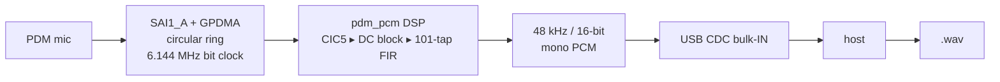

# Microphone & PCM recording

The STM32 node carries **PDM microphones**. The firmware turns one mic into a
48 kHz PCM stream and sends it to a host over the board's **USB CDC ACM** virtual
COM port. The host tool [`stm32node-cli`](#host-tool-stm32node-cli) records that
stream to a WAV file — handy for bringing up and sanity-checking the audio path
without an SD card.

## Signal path



- `Core/Src/mic.c` — acquisition (SAI1 + GPDMA ring buffer, half/full callbacks).
- `Core/Src/pdm_pcm.c` — the PDM→PCM DSP (runs from the instruction cache; see
  [Real-time budget](#real-time-budget-why-the-clock-matters)).
- `Core/Src/pcm_stream.c` — the `stream`/`streamtest` command: header, PCM blocks,
  and the `PCMEND` trailer.

## Connect the board to your machine

The board exposes **two independent USB devices**, and for microphone work you
need both forwarded into WSL/the devcontainer:

| Device | Purpose | Shows up as |
|--------|---------|-------------|
| **ST-Link V3** (`0483:374e`) | flashing + SWD debug; also an ST-Link VCP | one `/dev/ttyACM*` (VCP) |
| **The board's own CDC** | the command console **and** the PCM stream | another `/dev/ttyACM*` |

!!! info "Install the USB forwarding first"
    On Windows you forward USB into WSL with **usbipd-win**. If you have not set it
    up, follow **[Share USB with usbipd](../../get-started/usbipd.md)** first, then
    come back. In short, from an **Administrator PowerShell**:

    ```powershell
    usbipd list                          # find the BUSIDs
    usbipd bind   --busid <busid>        # once per device (persists)
    usbipd attach --wsl --busid <busid>  # repeat after every replug/flash
    ```

    Attach **both** the ST-Link and the board CDC.

### Which `/dev/ttyACM*` is the board?

The mapping between `ttyACM0`/`ttyACM1` and the two devices is **not stable** — it
can swap between sessions. Identify the board reliably instead of guessing:

```bash
# List ports with descriptions (the board reports "boomchecker-node")
cd fw/apps/stm32node-cli && .venv/bin/python -m stm32node_cli ports

# Or map each node to its USB device explicitly
for t in /dev/ttyACM*; do n=$(basename "$t"); \
  echo "$n -> $(readlink -f /sys/class/tty/$n/device)"; done
```

The board's CDC is the node whose USB path ends in **`1-1:1.0`** (the boomchecker
CDC), *not* the ST-Link's `…:1.2`.

!!! note "\"Joystick in FS Mode\"?"
    `lsusb` may label the board `0483:5710 … Joystick in FS Mode`. That is just the
    usbutils name for that VID:PID — the real USB **product string is
    `boomchecker-node`** and the device is a normal CDC ACM. Ignore the label.

!!! warning "The board drops off WSL on every flash/reset"
    Flashing or resetting re-enumerates the board's USB, which breaks its usbipd
    attachment (the ST-Link stays put). After `task flash` you must
    **`usbipd attach --wsl --busid <board>`** again before the port reappears.
    Auto-attach, if configured, can take a minute.

## Firmware console commands

The board runs a small text console (embedded-cli) on the CDC port. Lines are
ASCII terminated by `\n`; the board echoes input and prints a `> ` prompt. You can
drive it with any terminal, but prefer the [host tool](#host-tool-stm32node-cli)
for streaming (it handles the binary framing).

| Command | Description |
|---------|-------------|
| `version` | Print the firmware version string. |
| `stream <sec>` | Stream `<sec>` seconds (1–60) of **microphone** PCM as a `PCM1` frame. |
| `streamtest <sec>` | Same framing, but a synthetic **1 kHz test tone** — verifies USB/framing without the mic. |

`stream`/`streamtest` emit a binary frame on the same pipe (see
[Wire protocol](#wire-protocol-pcm1)), so read them with the host tool rather than
a plain terminal.

## Host tool: `stm32node-cli`

A Python (Typer + Textual) companion under `fw/apps/stm32node-cli`. It speaks the
`PCM1` protocol, records to WAV, and offers an interactive TUI.

### Install

```bash
# From the repo root — creates .venv and installs the package (editable) + dev deps
task stm32-cli:setup
```

### Record to a WAV (headless)

```bash
cd fw/apps/stm32node-cli

# Record 5 s of microphone audio to the default output folder
.venv/bin/python -m stm32node_cli record 5 --port /dev/ttyACM0

# Synthetic 1 kHz tone instead of the mic (hardware-independent smoke test)
.venv/bin/python -m stm32node_cli record 5 --port /dev/ttyACM0 --test-tone

# List available serial ports
.venv/bin/python -m stm32node_cli ports
```

`record N` saves `N` seconds (the board rounds up to whole ~21 ms blocks) of
48 kHz / 16-bit mono PCM as a `.wav`. Use `--out <dir>` to change the destination.

### Interactive TUI

```bash
task stm32-cli:run -- --port /dev/ttyACM0
```

The TUI has a port picker, `record <sec>` / `test <sec>` commands, a live progress
bar, and a health readout (`overrun` / `err`) printed after each capture.

### All tasks

| Task | What it does |
|------|--------------|
| `task stm32-cli:setup` | create `.venv`, install the package + dev deps |
| `task stm32-cli:run` | launch the TUI (`-- --port /dev/ttyACM0`) |
| `task stm32-cli:test` | run the test suite (no hardware needed) |
| `task stm32-cli:lint` | ruff |
| `task stm32-cli:proto` | regenerate `PROTOCOL.md` from the spec |

From the board's own firmware directory you can open the TUI straight against the
board with **`task m`** (see below).

## Build, flash, monitor

From `fw/bom-stm32node/` (see [Build & flash](build.md) for the full toolchain):

| Task | Alias | Action |
|------|-------|--------|
| `task build` | `task b` | build the firmware (Debug) |
| `task flash` | `task f` | flash over ST-Link (OpenOCD) — re-attach USB afterwards |
| `task monitor` | `task m` | open the `stm32node-cli` TUI against the board |

## Wire protocol (`PCM1`)

`stream`/`streamtest` send a fixed **16-byte little-endian header** (magic `PCM1`,
version, channels, sample rate, and the authoritative `byte_length`), then exactly
`byte_length` bytes of raw `int16` PCM, then a one-line trailer:

```
PCMEND overrun=<0|1> err=<0|1>
```

- `overrun=1` — acquisition dropped samples (gaps in the capture).
- `err=1` — the source produced no data (e.g. mic not running); the payload was
  padded with silence so `byte_length` is always honoured.

The full, authoritative contract is generated from the firmware-facing spec:
`fw/apps/stm32node-cli/PROTOCOL.md` (regenerate with `task stm32-cli:proto`).

## Real-time budget (why the clock matters)

Each ring half is **1024 samples = 21.33 ms** of audio, and the DSP
(`pdm_pcm_process_half`) must finish one half faster than real time or the mic
**overruns** (the trailer reports `overrun=1` and a capture takes longer than the
requested duration). Two things are required for that to hold:

1. **The 250 MHz system clock must be real.** The clock is derived from the
   external **HSE**. The Nucleo default routes an **8 MHz clock from the ST-Link
   MCO** (solder bridges `SB3`/`SB4` **OFF**), but the PLL is configured for a
   **24/25 MHz** crystal — with the 8 MHz source the core silently runs at
   ~83 MHz (3× too slow) and the DSP misses its budget. Use the on-board **25 MHz
   crystal** (`SB3`/`SB4` **ON**) so the core really runs at 250 MHz.
2. **The instruction cache is enabled.** Even at 250 MHz the DSP overruns with the
   I-cache off (~39 ms/half from flash-fetch stalls); enabled it is ~17 ms.
   `main.c` turns on `ICACHE` at startup, and `pdm_pcm.c` is compiled `-O2`.

## Troubleshooting

| Symptom | Likely cause / fix |
|---------|--------------------|
| `PCMEND overrun=1`, capture takes longer than `N` s | Core not at 250 MHz (wrong HSE — use the 25 MHz crystal, see above), or I-cache disabled. |
| `PCMEND err=1`, silent WAV | Mic/SAI not producing data. Check the SAI/PDM CubeMX config and wiring. |
| Port not found / `record` can't open it | Board not attached to WSL — `usbipd attach --wsl` again (re-attach after every flash). |
| Wrong `/dev/ttyACM*` | Mapping swapped; identify the board via `ports` or the `1-1:1.0` sysfs path. |
| `streamtest` clean but `stream` bad | Problem is in acquisition/DSP, not USB/framing (the tone bypasses the mic). |
| First stream after attach is slow (~15 s) but `overrun=0` | Benign WSL/usbip warm-up on the first bulk transfer; later streams are real-time. |
