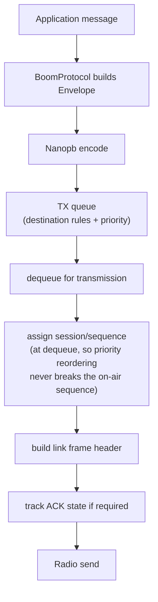
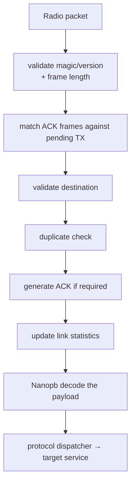
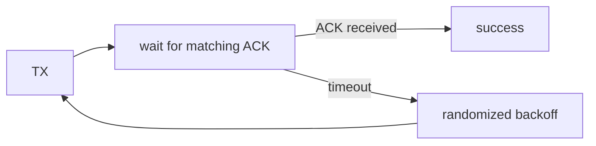

# BoomLink

BoomLink is the LoRa point-to-point link layer. It operates on **link frames**: a small
fixed binary header plus an opaque serialized `Envelope` payload (the BoomProtocol
message — see [BoomProtocol](boomprotocol.md)). BoomLink never looks inside that
payload and has no Protobuf/Nanopb dependency — it filters, acknowledges and
deduplicates packets by inspecting only its own header bytes.

Source: `fw/common/boomlink/linkframe/` (the frame header codec) and
`fw/common/boomlink/linkengine/` (addressing, ACK, retry, duplicate suppression, the TX
queue) — both target-agnostic C, host-testable against a fake radio. The STM32-specific
glue (`App/link/link_service.c`, wiring a real radio in) is a thin call site on top.

## Link frame

Every LoRa packet is one BoomLink frame:

```text
+--------------------+----------------------------------+
| link frame header  | serialized Protobuf Envelope      |
| (fixed binary,     | (Nanopb; DATA frames only)         |
|  20 bytes)         |                                    |
+--------------------+----------------------------------+
```

The header is deliberately **not Protobuf** — BoomLink must be able to reject foreign
traffic and match ACKs by inspecting a few leading bytes, without invoking a decoder.
It is the only hand-packed binary structure on the air interface.

| Offset | Size | Field | Notes |
|---|---|---|---|
| 0 | 1 | magic / network ID | runtime-configurable, default `0xB0` |
| 1 | 1 | version (high nibble) \| frame type (low nibble) | |
| 2 | 1 | flags | bit 0: `ack_requested`, bit 1: `more_fragments`, bits 2–7 reserved (must be 0, ignored if set) |
| 3 | 1 | fragment_index | always `0` — no fragmentation implemented yet |
| 4 | 4 | destination_id | little-endian |
| 8 | 4 | source_id | little-endian |
| 12 | 4 | session_id | little-endian |
| 16 | 4 | sequence | little-endian |

Frame types:

| Type | Value | Payload |
|---|---|---|
| `DATA` | 1 | header + serialized `Envelope` |
| `ACK` | 2 | header only, no payload |

A packet whose magic/network ID or protocol version doesn't match is dropped and
counted before any further processing. LoRa's own PHY CRC is relied on; the link frame
adds none of its own.

## Addressing

```text
0x00000000              invalid / unconfigured node
0x00000001..0xFFFFFFFE  normal node IDs
0xFFFFFFFF               broadcast
```

A node accepts a frame when `destination_id == its own node_id` **or**
`destination_id == 0xFFFFFFFF` — but only once it has a valid node_id itself: a node
whose own address isn't in `0x00000001..0xFFFFFFFE` accepts nothing at all, broadcast
included. This closes two failure modes: a factory-fresh node (address `0`) matching
traffic meant for "unconfigured", and a node misconfigured to the broadcast address
answering on behalf of the whole network.

There is no special "master" address — see [LoRa → Naming](index.md#naming).

!!! danger "No sender authentication — trusted-network design, for now"
    `source_id` is whatever the sender put in its own frame header — nothing checks it
    against the radio identity that actually transmitted the packet. A frame with valid
    magic/version and a forged `source_id` is dispatched exactly like a genuine one,
    which means state-changing traffic (a `Command`, a `ConfigSet`) can be spoofed by
    anything sharing the network's magic byte and radio parameters. This is a
    deliberate, documented, current limitation — not an oversight left in by accident —
    tracked for a future authentication baseline in issue
    [#77](https://github.com/boomchecker/boomchecker-monorepo/issues/77). Until that
    lands, treat every node on a given `magic` as mutually trusted.

## TX pipeline



A retransmission reuses the already-assigned `(session_id, sequence)` — only the first
transmission of a frame assigns a new one.

## RX pipeline



Malformed packets are dropped and counted — a bad link header at this layer, a failed
Protobuf decode one layer up — and neither class ever reaches an application handler.

## Sequence and session

Each node keeps a `session_id` generated once per boot and a `sequence` counter
incremented per transmitted envelope. A packet's link-level identity is
`(source_id, session_id, sequence)`. A new `session_id` after a reboot is what lets a
peer's duplicate cache re-key instead of treating a restarted sequence counter as a
wave of duplicates.

!!! warning "That new session_id isn't reliably new"
    `session_id` is derived from this chip's fixed UID XORed with the boot-time tick
    count. On a healthy board, every step from reset to this derivation is either
    straight-line code or a fixed-length delay — no variable-length wait — so the tick
    term reads the *same* value on every single reboot, making an identical
    `session_id` the common case, not a rare one. A peer's duplicate cache then sees a
    session it already knows, with a sequence counter that just restarted from 0, and
    silently suppresses the rebooted node's early post-boot frames as replays **while
    still ACKing them** — so an ACKed send doesn't actually mean the payload reached
    the peer's application. A real, known gap, not yet fixed — tracked in issue
    [#91](https://github.com/boomchecker/boomchecker-monorepo/issues/91).

## Duplicate suppression

Retransmission can deliver the same valid packet more than once; an application handler
must see it at most once.

- a statically-allocated table of the 16 most recently active `(source_id, session_id)`
  pairs (ample for a 5–10 node network);
- each entry tracks the highest accepted sequence plus a small bitmap window below it
  (tolerates minor reordering);
- LRU eviction when full;
- a new `session_id` from a source already in the table **reuses** that entry (the peer
  rebooted) rather than adding a second one.

A duplicate is never re-dispatched to the application, but if it was unicast and
requested ACK, the ACK is sent again — a broadcast frame is never ACKed at all, matching
the ACK rules below.

## ACK

ACK is a **link-layer delivery acknowledgement**, not an application response — a
command can produce both an ACK ("the packet arrived") and a `CommandResponse` ("the
command ran, and here's the result"). ACK is a link frame *type*, not a Protobuf
message, and carries no payload:

```text
frame type      = ACK
destination_id  = original source_id
source_id       = acknowledging node
session_id      = original packet's session_id
sequence        = original packet's sequence
ack_requested   = 0
```

Rules:

- ACK frames never request another ACK;
- broadcast frames never request (or receive) an ACK, whatever their flags say;
- a duplicate of an ACK-requested **unicast** frame causes the ACK to be resent;
- ACK confirms link delivery only — never semantic success of the payload. Application
  request/response correlation uses `MessageHeader.request_id`, not the link sequence.

## Retry

BoomLink v1 is **stop-and-wait**: at most one ACK-pending frame is outstanding at any
time, globally, across the whole node — the radio is half-duplex, so transmitting a
second frame while waiting for an ACK would mean missing it.



- default 3 total transmission attempts;
- randomized backoff on each retry (separate range from the first-transmission jitter
  below);
- a retransmission reuses the same `(session_id, sequence)`, so the receiver's
  duplicate cache still recognizes it;
- final failure is surfaced to the caller and counted — BoomLink does not retry forever.

The outcome reported to a caller distinguishes three cases: **acked** (delivery
confirmed), **sent** (no ACK was requested, so nothing more is known), and **no ack**
(every attempt transmitted, none acknowledged — the frame may still have arrived; only
the ACK was lost).

## Random jitter (collision avoidance)

Several nodes can detect the same event (a gunshot, say) at almost the same instant. If
every node transmits immediately, collision probability is high. BoomLink draws a
random delay, uniform over `[0, tx_jitter_max_ms]`, applied once before a frame's
*first* transmission (a retry uses the retry backoff range instead). This applies to
**every** queued frame, not only detections — the link layer never looks inside the
payload, so it can't tell one message type from another. Setting the max to `0`
disables the delay.

The original event timestamp is captured *before* this delay, so localization timing
is never affected by radio scheduling.

## Priority TX queue

| Priority | Traffic |
|---|---|
| **HIGH** | command responses, critical system messages |
| **NORMAL** | detection events, configuration responses, Ping/Pong, fleet-discovery Wakeup |
| **LOW** | periodic telemetry, non-critical diagnostics |

!!! note "ACK never enters this queue"
    Despite being nominally a HIGH-priority frame type, an ACK is sent synchronously
    from the RX path the instant it's generated — it never touches the TX queue at all.
    There's nothing to prioritize: at most one frame is ever mid-flight (see
    [Retry](#retry)), so an ACK can't be queued behind anything.

The queue is statically bounded; when full, the lowest-priority queued frame is dropped
to make room. Sequence numbers are assigned at dequeue, so priority reordering never
breaks the on-air sequence.

**LOW** exists in code (`BOOMLINK_TXPRIO_LOW`) but nothing sends at that priority
today — no telemetry subsystem exists yet to generate the traffic it's meant for (see
[BoomProtocol → Telemetry](boomprotocol.md#telemetry)).

!!! note "Reordering, not preemption"
    This only reorders the *queue*. Once a frame leaves the queue into the single
    global retry pipeline (see [Retry](#retry) above), nothing can displace it — a
    low-priority frame already mid-retry holds that slot for the rest of its
    retry/backoff cycle even if a high-priority frame is queued behind it. That's
    bounded by the attempt count and backoff range (low digits of seconds at this
    network's traffic rate), not indefinite.

## Broadcast

Destination `0xFFFFFFFF`. Broadcast frames never request (or receive) a link ACK.
Commands or config writes that would be dangerous if broadcast (`Reboot`, a
`ConfigSet`) are rejected by the application service unless explicitly designed for it
— see [BoomProtocol](boomprotocol.md).

## Statistics

Exposed via `link status` (see [CLI reference](#cli-reference) below) and
`boomlink_link_get_stats()`:

TX envelopes · RX envelopes · TX retries · TX failures · RX duplicates · malformed
packets · packets for another destination · ACK sent/received · unmatched ACK ·
invalid-source frames · oversize packets · rejected by magic/version · dropped before
queueing · shed for more urgent traffic · cumulative TX airtime · last RSSI/SNR.

## Current defaults

| Parameter | Value |
|---|---|
| Network magic | `0xB0` |
| ACK timeout margin | 50 ms |
| Max transmission attempts | 3 |
| Retry backoff range | 100–400 ms |
| First-TX jitter range | 0–50 ms |

!!! warning "`ConfigSet` accepts these fields today, but most have no real effect yet"
    `LinkConfig` (including all five defaults above) can be written via `ConfigSet` —
    it's validated, versioned, and persisted to flash — but nothing in the firmware
    currently reads any of these five fields back to reconfigure the running link
    engine: `link_service_init()` hardcodes them from its own constants at boot,
    regardless of what's in flash, and nothing calls the link engine's reconfigure
    entry point outside of host tests. Writing a new backoff range or jitter max today
    has no observable effect, live or after a reboot.

    `node_id` and `magic` are different: a write to either **does** eventually take
    effect — but only from `link_service_init()`'s *next* boot-time read, since there's
    no live address/network-ID change either. See
    [BoomProtocol → Configuration](boomprotocol.md#configuration) for the full picture,
    including the radio profile (same "accepted but not applied" gap).

## CLI reference

| Command | Effect |
|---|---|
| `link status` | node ID, session ID, TX state, queue depth, most statistics (cumulative TX airtime isn't printed today) |
| `link enable` / `link disable` | link engine owns the radio's RX path / hands it back to raw `radio ping` |
| `link ping <node_id_hex> [text]` | send a unicast frame with ACK requested — the ACK itself *is* the "pong" |
