# LoRa

The STM32 node (`bom-stm32node`) talks to other nodes over LoRa using two custom
protocols, layered on top of each other:

- **[BoomLink](boomlink.md)** — the link layer. Addressing, delivery (ACK/retry),
  duplicate suppression, and a priority TX queue, on top of the raw radio.
- **[BoomProtocol](boomprotocol.md)** — the message layer. What a node can actually
  *say* to another node — commands, configuration, discovery, detections, telemetry —
  encoded as Protobuf and carried inside a BoomLink frame.

This is **not LoRaWAN**. It is a small, private point-to-point/broadcast network for a
handful of nodes (a few to a few dozen), with its own framing and its own addressing.

## Architecture

```mermaid
flowchart TB
    subgraph app["Application"]
        direction LR
        cmdh["Command<br/>handlers"]
        cfgr["Runtime<br/>configuration"]
        det["Detection<br/>subsystem"]
        tel["Telemetry<br/>subsystem"]
    end

    subgraph svc["Message services"]
        direction LR
        cmds["CommandService"]
        cfgs["ConfigService"]
        syss["SystemService"]
        dets["DetectionService*"]
        tels["TelemetryService*"]
    end

    subgraph proto["BoomProtocol"]
        direction LR
        env["Envelope +<br/>MessageHeader"]
        pb["Protobuf<br/>schemas"]
        codec["Nanopb<br/>codec"]
        disp["protocol<br/>dispatcher"]
    end

    subgraph link["BoomLink"]
        direction LR
        frame["link frame<br/>header codec"]
        addr["node<br/>addressing"]
        ack["ACK +<br/>retry"]
        dup["duplicate<br/>suppression"]
        q["priority<br/>TX queue"]
    end

    subgraph radio["Radio"]
        direction LR
        radiolib["RadioLib"]
        hal["STM32 HAL<br/>adapter"]
        spi["SPI1 +<br/>GPIO/EXTI"]
    end

    hw["EBYTE E22-900M22S<br/>(SX1262)"]

    app --> svc --> proto --> link --> radio --> hw
```

*Detection/telemetry services don't exist yet — the dispatcher only recognizes and
counts those message types today. See [BoomProtocol → implementation status](boomprotocol.md#implementation-status).

The dependency direction is one-way: application code never calls RadioLib directly,
and the radio layer never knows a Protobuf message type exists.

### Naming

| Layer | Job |
|---|---|
| **BoomProtocol** | Application-level message contract and serialization (Protobuf/Nanopb). |
| **BoomLink** | The LoRa point-to-point link layer — carries an encoded BoomProtocol `Envelope` inside a small fixed binary frame. Never decodes Protobuf. |
| **Radio** | Thin hardware abstraction over the SX1262, implemented with RadioLib. |

This split matters for one concrete reason: BoomProtocol is meant to be usable over a
different transport later (USB, say) without inheriting LoRa's ACK/retry behaviour —
that behaviour lives entirely in BoomLink, one layer down.

There is **no special "master" node address**. A node acting as a collection point
(a USB gateway, or the fleet-discovery use case in [BoomProtocol → System
messages](boomprotocol.md#system-messages)) is a normally-addressed node with that role
enabled at the application layer — addressing itself has no concept of one.

## The radio hardware

The board carries an **EBYTE E22-900M22S** module (an SX1262 LoRa transceiver) on SPI1,
driven through RadioLib. A few things specific to this deployment:

- **Private sync word** (`RADIOLIB_SX126X_SYNC_WORD_PRIVATE`), not the public LoRaWAN
  one — foreign LoRa traffic is mostly rejected at the PHY level before it ever reaches
  BoomLink.
- **Czech/EU regulatory band**: the E22 module covers 850–930 MHz at up to +22 dBm,
  which is wider and stronger than legal here. The default profile below targets the
  **869.4–869.65 MHz** sub-band (ERC 70-03's most permissive allocation: up to 500 mW
  ERP, 10 % duty cycle) — but that's a frequency/power *setting*, not a compliance
  guarantee: actual radiated ERP depends on the antenna actually fitted (module output
  plus antenna gain, unverified here), and **nothing in the firmware enforces the 10 %
  duty cycle automatically** — there's a cumulative TX-airtime counter (see
  [BoomLink → Statistics](boomlink.md#statistics)) for checking it by hand, but no
  code path that refuses a transmission for exceeding it. Treat the profile below as a
  bring-up default, not a certified deployment configuration.
- **Default radio profile**, as currently flashed:

    | Parameter | Value |
    |---|---|
    | Frequency | 869.525 MHz |
    | Bandwidth | 125 kHz |
    | Spreading factor | SF7 |
    | Coding rate | 4/5 |
    | TX power | 14 dBm |
    | Preamble | 8 symbols |
    | Sync word | private |

    `RadioConfig` can be written remotely via `ConfigSet` today — validated, staged
    through the same revert-on-timeout confirmation window as `node_id`/`magic` (see
    [BoomProtocol → Configuration](boomprotocol.md#configuration)) — but nothing yet
    reads the stored value back into the radio: it's brought up with this hardcoded
    profile on every boot regardless of what's in flash. The confirm/revert state
    machine runs correctly; it just isn't wired to anything with a real effect yet.

## In this section

- **[BoomLink](boomlink.md)** — frame layout, addressing, ACK/retry, duplicate
  suppression, the priority TX queue, and link statistics.
- **[BoomProtocol](boomprotocol.md)** — the `Envelope`/`MessageHeader` framing, and the
  full catalog of messages the firmware sends and understands today, with an
  implementation-status column for each.
