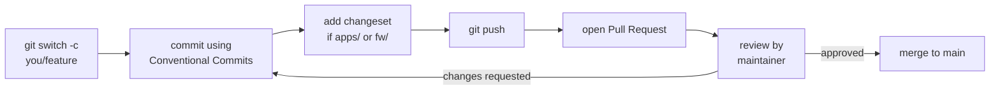

# Contributing (theses)

This page is the workflow for landing your work — whether it's a one-line fix or an
entire bachelor's/master's thesis. The model is **branch in the monorepo, then open a
Pull Request**.

## Getting access

1. Ask Martin Maxa (`maxamart@fel.cvut.cz`) to add you to the **Boomchecker GitHub
   organization** and give you write access to the monorepo.
2. Once you're a member, you can push branches directly (no fork needed).

## Where your thesis work lives

Put your work in the area it belongs to:

- New firmware → `fw/`
- A backend feature or service → `apps/`
- A signal-processing experiment / analysis → `scripts/`
- Hardware → `hw/`

If your thesis spans several areas, that's fine — that's the point of a monorepo. Keep
each PR focused on one coherent change rather than dumping everything at once.

## The workflow



1. **Branch** off an up-to-date `main`:

    ```bash
    git switch main && git pull
    git switch -c yourname/feature-name
    ```

2. **Commit** in small, logical steps using
   [Conventional Commits](monorepo-rules.md#conventional-commits).

3. **Changeset** — if you touched a versioned package (`apps/**`, `fw/**`), run
   `task changeset` and commit the generated file.

4. **Push** and **open a PR** against `main`:

    ```bash
    git push -u origin yourname/feature-name
    ```

    Then open the PR on GitHub (or via the VS Code **GitHub Pull Requests** panel).
    Write a clear description: what, why, and how to test it.

5. **Review.** A maintainer reviews. Push more commits to the same branch to address
   feedback — the PR updates automatically. When approved, it's merged into `main`.

## PR checklist

Before you request review:

- [ ] Branch name is `yourname/...`.
- [ ] Commits follow Conventional Commits.
- [ ] Changeset added if a versioned package changed.
- [ ] Code builds / tests pass in the devcontainer.
- [ ] PR description explains the change and how to verify it.
- [ ] No unrelated files (no build output, no secrets, no `node_modules`).

!!! tip "Keep your branch fresh"
    If `main` moved while you worked, update your branch:

    ```bash
    git switch main && git pull
    git switch yourname/feature-name
    git merge main      # or: git rebase main
    ```

## Documentation is part of the work

If your change adds a component or a workflow others will use, document it here. These
docs are just Markdown under `docs/` — add a page, link it in `mkdocs.yml`, preview with
`task docs:serve`, and include it in your PR.

That's it — welcome aboard.
