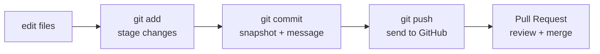

# Git basics

If you have used git before, skim this and move on to [Monorepo rules](monorepo-rules.md).
If git is new, read carefully — this is the minimum you need to work safely in a shared
repository.

## The mental model

Git tracks the history of your project as a series of **commits** (snapshots). Work
happens on **branches** so your changes stay isolated until they're ready. You push
branches to **GitHub**, then open a **Pull Request (PR)** to merge them into `main`.



## One-time setup

Tell git who you are (do this inside the devcontainer, or on the host — both):

```bash
git config --global user.name "Your Name"
git config --global user.email "you@example.com"
```

Use the **same email as your GitHub account** so commits are attributed to you.

## The everyday loop

```bash
# 1. Start from an up-to-date main
git switch main
git pull

# 2. Create your own branch (see naming in Monorepo rules)
git switch -c yourname/short-description

# 3. ...do your work, then see what changed
git status
git diff

# 4. Stage and commit
git add path/to/file        # or: git add -A  to stage everything
git commit -m "feat(scope): describe what you did"

# 5. Push your branch to GitHub
git push -u origin yourname/short-description
```

After pushing, open a Pull Request (see [Contributing](contributing.md)).

## Useful commands

| Command | What it does |
| ------- | ------------ |
| `git status` | What's changed / staged right now. |
| `git diff` | Line-by-line changes you haven't staged. |
| `git log --oneline -10` | The last 10 commits, compact. |
| `git switch <branch>` | Move to an existing branch. |
| `git switch -c <branch>` | Create and move to a new branch. |
| `git restore <file>` | Throw away uncommitted changes to a file. |
| `git pull` | Fetch + merge the latest from GitHub. |

!!! warning "Never commit directly to `main`"
    Always work on a branch and merge through a PR. Pushing to `main` is blocked and,
    even if it weren't, it skips review. See [Contributing](contributing.md).

!!! tip "Use the VS Code Source Control panel"
    The **Source Control** tab (`Ctrl+Shift+G`) does stage/commit/push with buttons, and
    the **GitHub Pull Requests** extension lets you open and review PRs without leaving
    the editor. The commands above are what those buttons run underneath.

Next: [Monorepo rules →](monorepo-rules.md)
