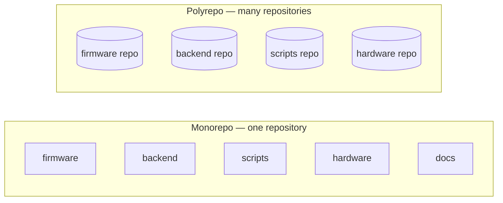
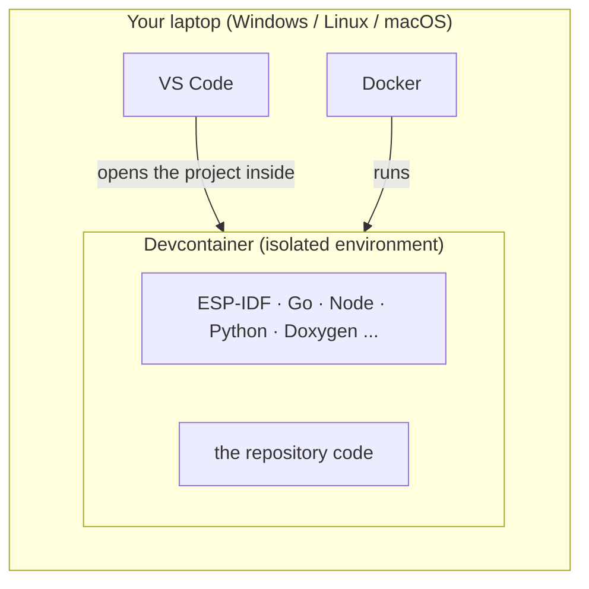
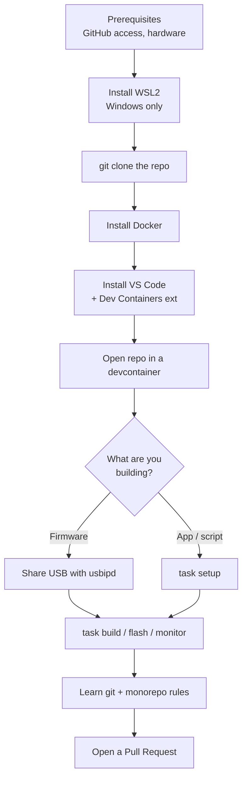

# Get Started

Welcome. This section takes you from a **fresh machine** to a **working build** of the
Boomchecker project, and teaches you the rules of the repository along the way. Read it
in order — each page assumes you finished the previous one. No prior experience with
git, Linux, or embedded development is assumed.

## What you're getting into

All Boomchecker work — firmware, backend services, signal-processing experiments, and
hardware — lives in **one repository** (a *monorepo*). You will work *inside* that
repository: clone it, make changes on your own branch, and open a Pull Request to merge
them. That whole flow is what these pages set up.

### What is a monorepo?

A **monorepo** ("mono" = one) is a single git repository that holds *all* the projects
of a system together, instead of scattering them across many separate repositories (the
"polyrepo" approach). In our case, one repository contains the firmware, the backend,
the scripts, the hardware design, and even this documentation.



### Why a monorepo (and why it suits us)

Compared to keeping each project in its own repository, a monorepo gives us:

- **One clone, the whole project.** You run a single `git clone` and have *everything* —
  no hunting for which repo holds what, no juggling access to ten different places.
- **One shared development environment.** Because all code lives together, a single
  [devcontainer](devcontainer.md) setup serves everyone (see the next section). With
  many repos, each would need its own environment to maintain.
- **Atomic, cross-cutting changes.** A change that touches firmware *and* the backend
  *and* the docs goes in **one Pull Request**, reviewed and merged together. In separate
  repos you'd open several PRs that can land out of order and break each other.
- **Shared history and tooling.** One issue tracker, one set of conventions
  ([commit rules](monorepo-rules.md)), one CI pipeline, shared libraries and templates —
  no duplication across repos.
- **Easy discovery.** New contributors (you!) can read the *entire* system in one place
  to understand how the pieces fit together — exactly what this site is for.

The trade-off is that the repository is bigger and everyone shares the same rules — but
for a research project where firmware, hardware, and software evolve together, that's a
feature, not a bug. The shared rules are in [Monorepo rules](monorepo-rules.md).

### The journey

The journey, in plain terms (each step links to its full guide):

1. **Get a Linux environment.** On Windows that means installing
   **[WSL2](wsl.md)** (a Linux system that runs inside Windows). On Linux you already
   have it. macOS works too — see [Prerequisites](prerequisites.md).
2. **Get the code.** [Clone this repository](#get-the-code).
3. **Install [Docker](docker.md).** It runs the prepared development environment for you.
4. **Open the project** in **[VS Code](vscode.md)**, which
   [starts that environment automatically](devcontainer.md).
5. **Build something** — [flash a device, run an app, or preview these docs](first-build.md).
6. **Learn the rules** ([git basics](git-basics.md), [monorepo rules](monorepo-rules.md))
   and [open your first Pull Request](contributing.md).

## Why we use containers (the important idea)

Boomchecker needs a lot of tools — ESP-IDF for the ESP32, Go for the backend, Node and
Python for tooling and scripts, Doxygen for docs, and more. Installing all of that by
hand, in the right versions, on every contributor's laptop is painful and fragile: it
works on one machine and breaks on another. The classic *"but it works on my machine"*
problem.

We solve it with **virtualization**. Instead of installing tools on your laptop, the
repository ships a **devcontainer**: a recipe for a lightweight virtual machine (a
Docker *container*) that already contains every tool, pinned to the exact right
version.



The payoff:

> The devcontainer builds the whole project with all its dependencies, with no manual
> setup. **Everyone who works in the monorepo gets the exact same base environment**, so
> the project behaves the same for everyone — your machine, a teammate's, or CI.

You edit files normally in VS Code; the building and running happen *inside* the
container. Your laptop stays clean — no toolchain installed on the host.

There are **two** devcontainers; you pick the one matching your work:

- **`fw-devcontainer`** — firmware: ESP32 (ESP-IDF) and STM32 (ARM/CMake).
- **`sw-devcontainer`** — software: Go, Node, Python, and these docs.

## Get the code

Once you have a terminal (WSL on Windows, or a normal terminal on Linux/macOS), clone
the repository. Use **SSH** if you have an SSH key set up with GitHub, otherwise
**HTTPS**:

=== "SSH (recommended)"
    ```bash
    git clone git@github.com:boomchecker/boomchecker-monorepo.git
    ```

=== "HTTPS"
    ```bash
    git clone https://github.com/boomchecker/boomchecker-monorepo.git
    ```

!!! note "No access yet?"
    Cloning a private repo requires being a member of the Boomchecker GitHub
    organization. See [Prerequisites](prerequisites.md) for how to get added.

!!! tip "On Windows, clone *inside* WSL"
    Clone into your Linux home (e.g. `~/boomchecker-monorepo`), not under `/mnt/c`.
    Files on the Linux side are much faster for Docker. More in [Install WSL2](wsl.md).

## The critical path



## Checklist

Work through these pages one by one:

1. [Prerequisites](prerequisites.md) — accounts, Windows version, hardware.
2. [Install WSL2](wsl.md) — the Linux layer Docker runs on (Windows only).
3. [Install Docker Desktop](docker.md) — the container engine.
4. [Install VS Code](vscode.md) — your editor + the Dev Containers extension.
5. [Open the devcontainer](devcontainer.md) — get the project running.
6. [Share USB with usbipd](usbipd.md) — only if you flash hardware.
7. [Your first build](first-build.md) — build, flash, monitor / run an app.
8. [Git basics](git-basics.md) — if git is new to you.
9. [Monorepo rules](monorepo-rules.md) — commits, scopes, changesets.
10. [Contributing (theses)](contributing.md) — how to land your work.

!!! note "Operating system"
    These guides assume **Windows + WSL2**, which is the primary setup. If you are on
    native **Linux** or **macOS**, each page has a short note for you — you can skip
    WSL and usbipd entirely on Linux.
