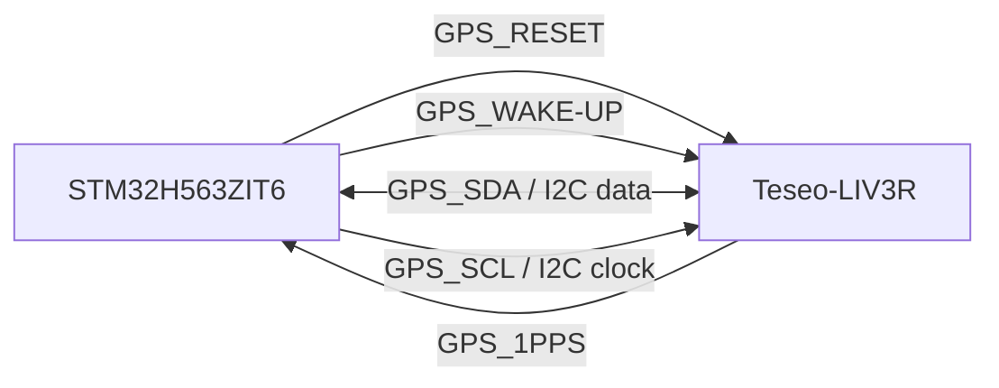
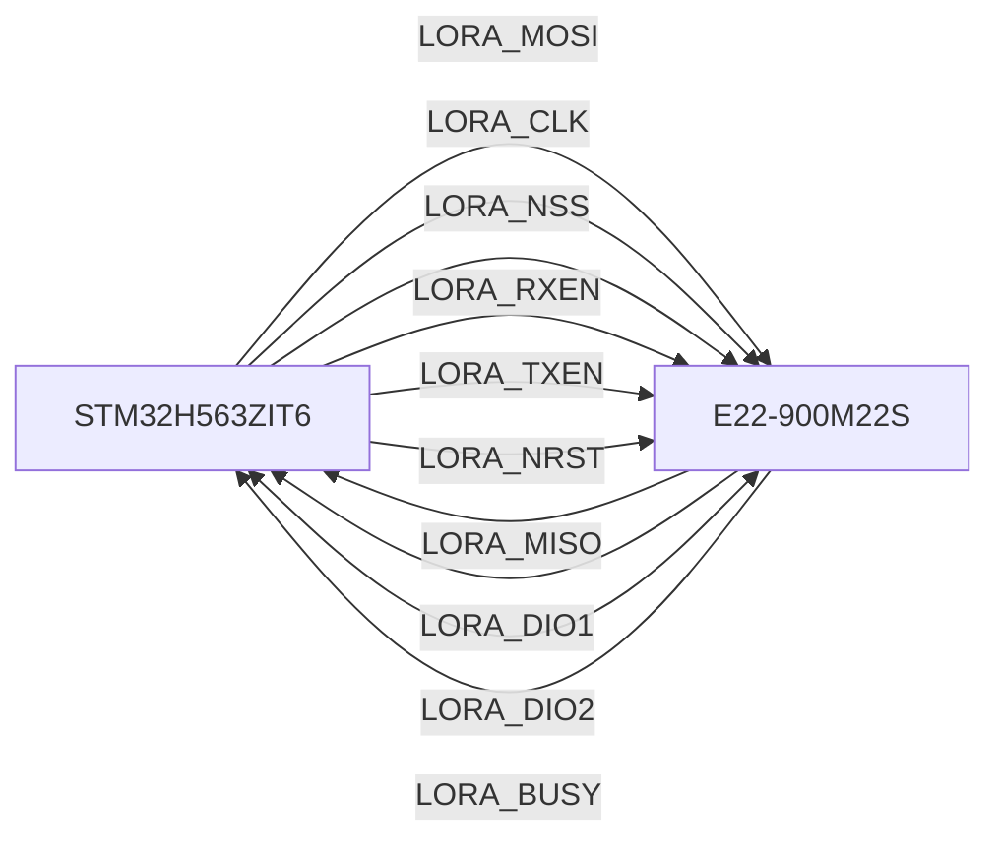
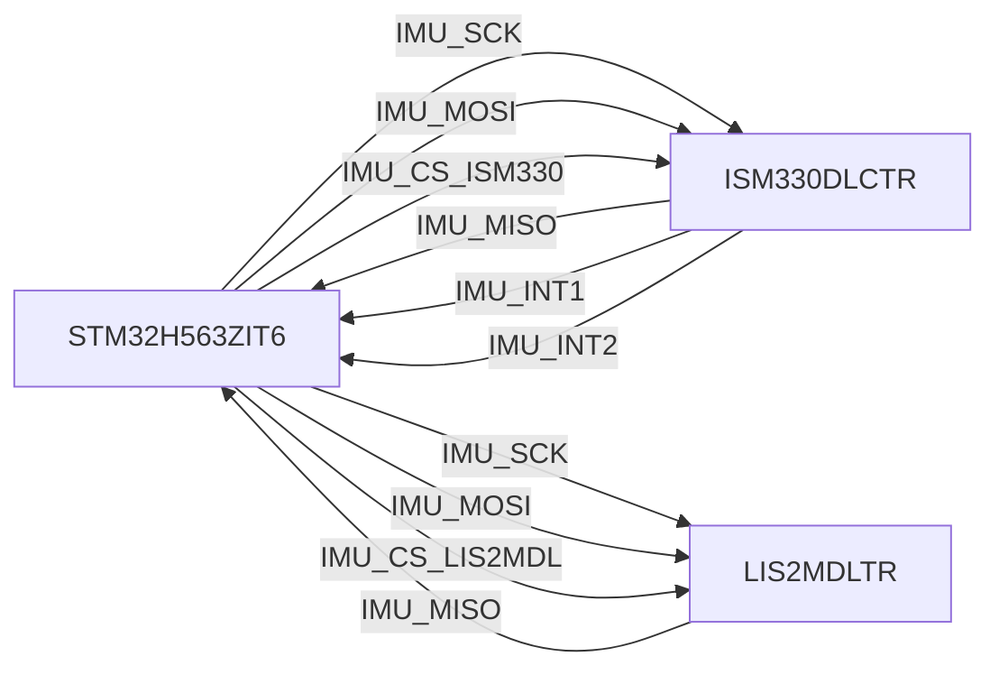
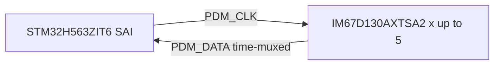

# BCH Node Hardware v0.1

Firmware-facing hardware notes for the `bch-node_v0.1` board revision. This
document is intended as an engineering handoff for STM32/CubeMX setup and
firmware bring-up, not as a replacement for the Altium project or component
datasheets.

## Source Status

- Hardware project: `bch-node_v0.1.PrjPcb`
- MCU: `STM32H563ZIT6`
- Primary schematic sheets: `top.SchDoc`, `mcu.SchDoc`, `gps.SchDoc`,
  `lora.SchDoc`, `imu.SchDoc`, `power.SchDoc`
- Existing CubeMX project: `fw/bom-stm32node/bom-stm32node.ioc`

The current `.ioc` file is treated as a firmware draft only. It must not be
used as the source of truth until reconciled against the Altium compiled
schematic or a verified pin/net export.

## Interface Summary

| Subsystem | Main component | Firmware interface | Status |
| --- | --- | --- | --- |
| MCU | `STM32H563ZIT6` | GPIO, SPI, I2C, USB, SAI/PDM | Pin map incomplete |
| GNSS | `Teseo-LIV3R` | I2C, GPIO, PPS interrupt | Harness verified, MCU pins TBD |
| LoRa | `E22-900M22S` | SPI, GPIO, IRQ/status | Harness verified, MCU pins TBD |
| IMU accel/gyro | `ISM330DLCTR` | SPI, GPIO interrupts | Device verified, MCU pins TBD |
| Magnetometer | `LIS2MDLTR` | SPI | Device verified, MCU pins TBD |
| PDM microphones | `IM67D130AXTSA2` | SAI/PDM clock and data | Design intent, schematic/CubeMX TBD |
| Power | USB-C, `BQ21040DBVR`, `TPS563252DRLR` | No MCU control currently planned | Out of pin-map scope |

## Naming Rules

- Board-level signals use subsystem prefixes, for example `GPS_SDA`,
  `LORA_MOSI`, `IMU_SCK`, and `PDM_CLK`.
- Module pin names are documented separately in each table.
- `TBD` means the value must be verified from Altium compiled netlist,
  schematic inspection, or a reviewed CubeMX assignment.
- Direction is written from the STM32 point of view.

## GNSS Interface

Component: `Teseo-LIV3R` GNSS module.

Harness signals are defined in `gps.Harness` and `mcu.Harness`:
`GPS_RESET`, `GPS_WAKE-UP`, `GPS_1PPS`, `GPS_SDA`, `GPS_SCL`.

| Board signal | Module pin | Type | Direction from STM32 | MCU pin | CubeMX function | Verification source | Notes |
| --- | --- | --- | --- | --- | --- | --- | --- |
| `GPS_RESET` | `RESET` | GPIO | Output | TBD | GPIO output | `gps.Harness`, `mcu.Harness` | Reset control for GNSS module |
| `GPS_WAKE-UP` | `WAKE-UP` | GPIO | Output | TBD | GPIO output | `gps.Harness`, `mcu.Harness` | Wake control for GNSS module |
| `GPS_1PPS` | `1PPS` | Timing pulse / interrupt | Input | TBD | GPIO EXTI or timer input | `gps.Harness`, `mcu.Harness` | Use for time synchronization |
| `GPS_SDA` | `SDA` | I2C data | Bidirectional | TBD | I2C SDA | `gps.Harness`, `mcu.Harness` | Open-drain bus behavior expected |
| `GPS_SCL` | `SCL` | I2C clock | Output | TBD | I2C SCL | `gps.Harness`, `mcu.Harness` | Clock generated by STM32 |

Firmware bring-up notes:

- Configure the GNSS I2C bus only after confirming the final STM32 pins and
  pull-up placement.
- Treat `GPS_1PPS` as an interrupt-capable signal. If precision timestamping
  is required, prefer a timer input capture capable pin over a plain EXTI line.
- Confirm the active level and timing requirements of `GPS_RESET` and
  `GPS_WAKE-UP` from the Teseo-LIV3R hardware manual before writing reset
  sequences.

## LoRa Interface

Component: `E22-900M22S` LoRa module.

Harness signals are defined in `lora.Harness` and `mcu.Harness`:
`MOSI`, `MISO`, `CLK`, `NSS`, `DIO1`, `DIO2`, `BUSY`, `RXEN`, `TXEN`, `NRST`.
The board-level signal names below use the `LORA_` prefix.

| Board signal | Module pin | Type | Direction from STM32 | MCU pin | CubeMX function | Verification source | Notes |
| --- | --- | --- | --- | --- | --- | --- | --- |
| `LORA_MOSI` | `MOSI` | SPI data | Output | TBD | SPI MOSI | `lora.Harness`, `mcu.Harness` | Board signal appears as `LORA_MOSI` in `mcu.SchDoc` |
| `LORA_MISO` | `MISO` | SPI data | Input | TBD | SPI MISO | `lora.Harness`, `mcu.Harness` | Board signal appears as `LORA_MISO` in `mcu.SchDoc` |
| `LORA_CLK` | `CLK` | SPI clock | Output | TBD | SPI SCK | `lora.Harness`, `mcu.Harness` | Harness pin is named `CLK`; CubeMX usually names this `SCK` |
| `LORA_NSS` | `NSS` | SPI chip select | Output | TBD | SPI NSS or GPIO output | `lora.Harness`, `mcu.Harness` | Prefer GPIO-controlled NSS unless hardware NSS is intentionally used |
| `LORA_DIO1` | `DIO1` | IRQ | Input | TBD | GPIO EXTI | `lora.Harness`, `mcu.Harness` | Primary radio interrupt |
| `LORA_DIO2` | `DIO2` | Digital I/O / optional IRQ / RF switch control | Config-dependent | TBD | GPIO or EXTI | `lora.Harness`, `mcu.Harness` | Direction depends on radio configuration |
| `LORA_BUSY` | `BUSY` | Status | Input | TBD | GPIO input | `lora.Harness`, `mcu.Harness` | Firmware must poll or gate commands on this signal |
| `LORA_RXEN` | `RXEN` | RF switch control | Output | TBD | GPIO output | `lora.Harness`, `mcu.Harness` | Receive path enable |
| `LORA_TXEN` | `TXEN` | RF switch control | Output | TBD | GPIO output | `lora.Harness`, `mcu.Harness` | Transmit path enable |
| `LORA_NRST` | `NRST` | Reset | Output | TBD | GPIO output | `lora.Harness`, `mcu.Harness` | Module reset control |

Firmware bring-up notes:

- Confirm whether `LORA_NSS` is controlled by hardware SPI NSS or plain GPIO.
  GPIO control is usually easier for radio drivers.
- `LORA_DIO1` must be interrupt-capable for typical LoRa/SX126x-style event
  handling.
- `LORA_BUSY` is a required input; radio commands must not be issued while the
  module reports busy.
- `LORA_DIO2`, `LORA_RXEN`, and `LORA_TXEN` behavior depends on the final RF
  switch and radio configuration.

## IMU Interface

Components:

- `ISM330DLCTR`: 6-axis accelerometer and gyroscope.
- `LIS2MDLTR`: 3-axis magnetometer.

Firmware intent: both sensors are documented as SPI devices. Final MCU pin
assignments and exact chip-select naming are still `TBD`.

### ISM330DLCTR

| Board signal | Sensor pin | Type | Direction from STM32 | MCU pin | CubeMX function | Verification source | Notes |
| --- | --- | --- | --- | --- | --- | --- | --- |
| `+3V` or sensor rail | `VDD` | Power | Power | N/A | N/A | `imu.SchDoc` | Main sensor supply |
| `+3V` or sensor I/O rail | `VDDIO` | Power | Power | N/A | N/A | `imu.SchDoc` | I/O logic supply |
| `GND` | `GND` | Power | Ground | N/A | N/A | `imu.SchDoc` | Pins 6 and 7 |
| `IMU_SCK` | `SCK` | SPI clock | Output | TBD | SPI SCK | User-provided map, `imu.SchDoc` | Sensor pin 13 |
| `IMU_MOSI` | `SDA` / `SDI` | SPI data | Output | TBD | SPI MOSI | User-provided map, `imu.SchDoc` | Sensor pin 14 |
| `IMU_MISO` | `SDO` | SPI data | Input | TBD | SPI MISO | User-provided map, `imu.SchDoc` | Sensor pin 1 |
| `IMU_CS_ISM330` | `CS` | Chip select | Output | TBD | GPIO output | User-provided map, `imu.SchDoc` | Sensor pin 12 |
| `IMU_INT1` | `INT1` | Interrupt | Input | TBD | GPIO EXTI | User-provided map, `imu.SchDoc` | Sensor pin 4 |
| `IMU_INT2` | `INT2` | Interrupt | Input | TBD | GPIO EXTI | User-provided map, `imu.SchDoc` | Sensor pin 9 |
| TBD | `SDO_Aux` | Aux interface | Depends on use | TBD | TBD | User-provided map, `imu.SchDoc` | Sensor pin 11; leave unassigned unless aux interface is used |
| TBD | `OCS_Aux` | Aux interface | Depends on use | TBD | TBD | User-provided map, `imu.SchDoc` | Sensor pin 10; leave unassigned unless aux interface is used |
| TBD | `SDx` | Aux interface | Depends on use | TBD | TBD | User-provided map | Sensor pin 2; leave unassigned unless aux interface is used |
| TBD | `SCx` | Aux interface | Depends on use | TBD | TBD | User-provided map | Sensor pin 3; leave unassigned unless aux interface is used |

### LIS2MDLTR

| Board signal | Sensor pin | Type | Direction from STM32 | MCU pin | CubeMX function | Verification source | Notes |
| --- | --- | --- | --- | --- | --- | --- | --- |
| `IMU_SCK` | `SCK` | SPI clock | Output | TBD | SPI SCK | `imu.SchDoc` | Shared SPI clock with IMU bus |
| `IMU_MOSI` | `SDI` | SPI data | Output | TBD | SPI MOSI | `imu.SchDoc` | Shared SPI MOSI with IMU bus |
| `IMU_MISO` | `SDO` | SPI data | Input | TBD | SPI MISO | `imu.SchDoc` | Shared SPI MISO with IMU bus |
| `IMU_CS_LIS2MDL` | `CS` | Chip select | Output | TBD | GPIO output | `imu.SchDoc` | Separate chip select from `ISM330DLCTR` |

Firmware bring-up notes:

- Keep separate chip-select GPIOs for `ISM330DLCTR` and `LIS2MDLTR`.
- Use interrupt-capable pins for `IMU_INT1` and `IMU_INT2` if motion events,
  data-ready signaling, or wake-up features are required.
- Aux interface pins on `ISM330DLCTR` are not firmware requirements unless the
  design explicitly uses the sensor hub/auxiliary interface.

## PDM Microphone Interface

Component: `IM67D130AXTSA2` Infineon PDM microphone.

Design intent: support up to five PDM microphones using one clock output and
one time-domain multiplexed data input. The STM32 peripheral target is `SAI`.
The detailed slot/decode behavior belongs in the STM32 firmware design notes
and must be verified against the final schematic and CubeMX support.

| Board signal | Microphone pin/function | Type | Direction from STM32 | MCU pin | CubeMX function | Verification source | Notes |
| --- | --- | --- | --- | --- | --- | --- | --- |
| `PDM_CLK` | Clock input | PDM clock | Output | TBD | SAI clock output | Design intent | Shared clock for PDM microphones |
| `PDM_DATA` | Data output | PDM data | Input | TBD | SAI data input | Design intent | Time-domain multiplexed input for up to five microphones |

Firmware bring-up notes:

- Configure the STM32 side through `SAI` if CubeMX supports the required PDM
  capture mode on the selected pins.
- Document the final microphone time-slot order in firmware once the schematic
  and capture peripheral are fixed.
- Verify the maximum supported microphone count for the selected SAI/PDM mode
  before relying on five channels in firmware.

## Power System

The v0.1 power system includes USB-C input, battery charging, and a DC/DC rail,
but no firmware-facing power control/status interface is currently planned.

Known hardware blocks:

- USB-C connector and USB ESD protection on `top.SchDoc`.
- Battery charger: `BQ21040DBVR`.
- DC/DC converter: `TPS563252DRLR`.
- Main visible nets include `+USB_VBUS`, `BAT+`, `BAT_ULVO`, and `+3V`.

This section is intentionally excluded from CubeMX pin mapping until a real MCU
control, status, or ADC connection is added.

## Draft CubeMX State

`fw/bom-stm32node/bom-stm32node.ioc` currently contains a partial STM32H563
configuration. Treat this as a draft only.

Visible draft assignments at the time this README was written:

| Draft `.ioc` item | Current setting | README treatment |
| --- | --- | --- |
| MCU | `STM32H563ZIT6`, LQFP144 | Matches hardware intent |
| `SPI1` | `PA4` NSS, `PA5` SCK, `PA6` MISO, `PA7` MOSI | Draft only; verify against schematic |
| `I2C1` | `PB6` SCL, `PB7` SDA | Draft only; verify against schematic |
| USB | `PA11` DM, `PA12` DP | Draft only; verify against schematic |
| `PA0` | `TIM5_CH1` input capture | Draft only; may be useful for timing signals |

Do not promote any draft `.ioc` pin to a final interface table until it is
verified against the Altium project.

## Revision Status

- Revision: `0.1`
- Project variant: `node`
- Main purpose of this README version: provide a structured firmware-facing
  hardware interface reference and make missing pin assignments explicit.

## Release Notes

- Initial hardware README for `hw/node/v0.1`.
- Documents GNSS, LoRa, IMU, magnetometer, and PDM microphone firmware
  interfaces.
- Keeps MCU pin and CubeMX function assignments as `TBD` until verified.
- Excludes power-system control from firmware pin mapping because there is no
  current MCU control/status plan.

## Known Issues

- Exact STM32 GPIO pins and alternate functions are not yet verified.
- Existing `.ioc` configuration is incomplete and must be reconciled with
  Altium before firmware relies on it.
- PDM microphone topology is documented as design intent and still needs
  schematic and CubeMX verification.
- IMU auxiliary pins are documented but not assigned to a firmware function.

## TODO / Verification Checklist

- Export or manually verify a compiled Altium netlist for all MCU-facing nets.
- Fill `MCU pin` and `CubeMX function` columns for GPS, LoRa, IMU, and PDM.
- Confirm whether LoRa NSS is hardware-controlled or GPIO-controlled.
- Confirm interrupt-capable pins for `GPS_1PPS`, `LORA_DIO1`, `IMU_INT1`, and
  `IMU_INT2`.
- Confirm SAI/PDM support for `PDM_CLK` and `PDM_DATA` on the selected STM32
  pins.
- Add the final microphone slot/channel ordering after PDM capture is proven.
- Reconcile `fw/bom-stm32node/bom-stm32node.ioc` with the verified hardware pin
  map.
