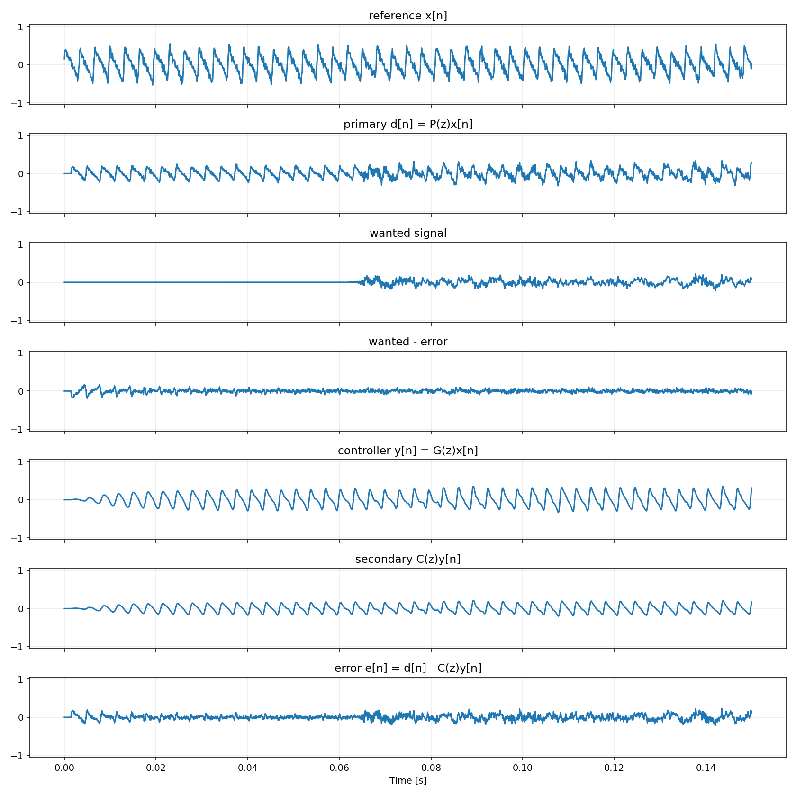
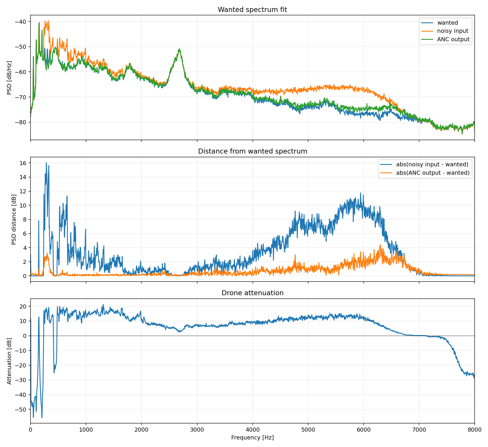
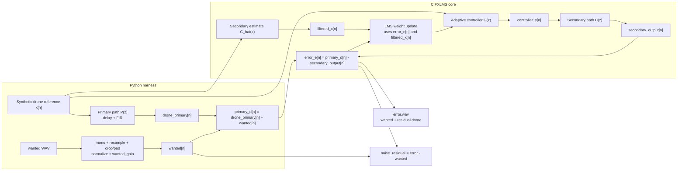

# FXLMS ANC Demo

Fixed-point filtered-x LMS active-noise-control demo for a future STM32H5 port.
The C core implements the adaptive controller and the Python harness builds a
repeatable microphone scenario: a synthetic drone reference is propagated
through a primary acoustic path, an optional useful WAV signal is mixed into the
microphone input, and the FXLMS loop tries to remove only the drone component.

## Quick Start

```bash
task setup
task build
task test
task run
```

Run the current WAV scenario:

```bash
task run -- --wanted-wav audio/tank-moving.wav --wanted-gain 0.35 --duration-s 10
```

Generated run artifacts are written to `python/out/`. Build products are
written to `build/`.

## Example Output

These images were generated with the current config and:

```bash
task run -- --wanted-wav audio/tank-moving.wav --wanted-gain 0.35 --duration-s 10
```

The time-domain plot uses the default plot window `0..0.15 s`; `--duration-s`
controls the simulated audio length, while `--plot-window` controls the visible
time window in this figure.



The spectral plot is computed after the initial settling window. It shows
whether the ANC output spectrum moved closer to the wanted signal than the noisy
microphone input did.



Current metrics from that run:

```json
{
  "primary_tail_mse": 0.016708899582089442,
  "error_tail_mse": 0.006398031285252526,
  "drone_primary_tail_mse": 0.010197285773336059,
  "noise_residual_tail_mse": 0.000457147099957284,
  "drone_attenuation_tail_db": 13.484286212956949,
  "plot_start_s": 0.0,
  "plot_end_s": 0.15
}
```

## CLI Parameters

All demo parameters are passed after `task run --`.

| Parameter | Default | Meaning |
| --- | ---: | --- |
| `--lib-path PATH` | `build/liblms_filter.so` | Shared library loaded by the Python harness. Run `task build` first if it is missing. |
| `--output-dir PATH` | `python/out` | Directory for WAVs, plots, and `metrics.json`. |
| `--fs HZ` | `16000` | Simulation sample rate. Input WAVs are resampled to this rate. |
| `--duration-s SEC` | `4.0` | Total simulation length. The synthetic drone and all output WAVs have this duration. A wanted WAV is cropped or zero-padded to this length. |
| `--seed N` | `7` | RNG seed for the synthetic drone turbulence/noise component. |
| `--reference-gain GAIN` | `1.0` | Gain applied to the drone reference `x[n]` before it enters the C FXLMS core. |
| `--wanted-wav PATH` | unset | Optional useful audio to preserve. Without it, the demo runs drone-only. |
| `--wanted-gain GAIN` | `0.35` | Gain applied after normalizing the wanted WAV. Increase it to make the useful signal louder relative to the drone. |
| `--mode MODE` | `siso` | Processing mode: `siso`, `sum-first`, or `miso`. |
| `--reference-count N` | `4` | Number of synthetic motor references for `sum-first` and `miso`; valid range is 1..4. |
| `--actuator-count N` | `4` | Number of actuator outputs for `sum-first` and `miso`; valid range is 1..4. |
| `--plot-window WINDOW` | `0..0.15` | Time-domain plot window for `fxlms_demo.png`. Accepts either a duration like `2` or an interval like `1.5..2`. |
| `--spectrum-window WINDOW` | post-settling tail | Window used for `fxlms_spectrum.png` and tail metrics. Accepts the same format as `--plot-window`. |
| `--plot-duration-s SEC` | unset | Deprecated alias for `--plot-window SEC`, kept for old commands. |
| `--multi-channel-comparison` | false | Run the synthetic 4-motor/4-actuator comparison instead of the SISO demo. |
| `--no-wav` | false | Skip writing WAV artifacts. Plots and metrics are still written. |

Examples:

```bash
# Drone-only demo, default 4 s simulation and 0..0.15 s time plot.
task run

# Use 10 s from a wanted WAV, preserving the default short plot window.
task run -- --wanted-wav audio/tank-moving.wav --wanted-gain 0.35 --duration-s 10

# Plot the first 2 s in fxlms_demo.png.
task run -- --wanted-wav audio/tank-moving.wav --duration-s 10 --plot-window 2

# Plot only the 1.5..2.0 s interval.
task run -- --wanted-wav audio/tank-moving.wav --duration-s 10 --plot-window 1.5..2

# Plot and analyze a sparse event window, such as a gunshot.
task run -- --wanted-wav audio/gunshot-vs-firecracker.wav --duration-s 10 --plot-window 5..6 --spectrum-window 5..6

# Put outputs somewhere else.
task run -- --output-dir /tmp/fxlms-run --wanted-wav audio/tank-moving.wav

# Compare summed-reference and multi-reference 4-actuator FxLMS modes.
task run -- --multi-channel-comparison --output-dir python/out/multi

# Run only one multi-channel mode.
task run -- --mode miso --reference-count 4 --actuator-count 4
task run -- --mode sum-first --reference-count 4 --actuator-count 4
```

## Signal Model

The Python harness owns the simulated acoustic scene. The C library owns the
adaptive FXLMS loop.



Mapping:

- `x[n]`: drone reference signal. In this demo it is synthetic and intentionally
  harmonic/periodic, with RPM drift and turbulence.
- `P(z)`: simulated primary acoustic path from drone/reference pickup to the
  error microphone. Implemented in Python as delay plus a short FIR.
- `wanted[n]`: optional useful WAV audio that should remain in the output.
- `primary_d[n]`: microphone input before ANC; this is the noisy signal.
- `G(z)`: adaptive FIR controller implemented in C.
- `C(z)`: simulated secondary path from controller/speaker output to the error
  microphone.
- `C_hat(z)`: secondary-path estimate used only for the filtered-x adaptation
  branch.
- `error_e[n]`: microphone residual after subtracting the anti-noise. In WAV
  mode this should contain the wanted signal plus as little drone as possible.
- `noise_residual`: analysis signal computed as `error - wanted`; this isolates
  the remaining drone component.

All FIRs use newest-sample-first tap order: tap `i` multiplies sample `n - i`.
This convention is shared by `G(z)`, `C(z)`, `C_hat(z)`, and `P(z)`.

## WAV Handling

When `--wanted-wav` is set:

1. The file is loaded with `scipy.io.wavfile.read`.
2. Integer PCM is converted to centered `float32`; floating-point WAVs are used
   as float data.
3. Multi-channel audio is averaged to mono.
4. Audio is resampled to `--fs` when needed.
5. Audio is cropped or zero-padded to exactly `--duration-s`.
6. Audio is normalized to a safe peak and scaled by `--wanted-gain`.
7. The final microphone input is `primary_d = drone_primary + wanted`.

`--duration-s` therefore sets both the simulation length and the amount of
wanted WAV used. It does not set the time window shown in `fxlms_demo.png`; use
`--plot-window` for that.

## Generated Files

| File | Written when | Meaning |
| --- | --- | --- |
| `metrics.json` | always | Numeric MSE, attenuation, plot paths, gains, and plot window metadata. |
| `fxlms_demo.png` | always | Time-domain view of selected signals. Controlled by `--plot-window`. |
| `fxlms_spectrum.png` | always | Welch PSD comparison and frequency-dependent attenuation after settling. |
| `reference.wav` | unless `--no-wav` | Drone reference `x[n]`. |
| `primary_d.wav` | unless `--no-wav` | Noisy microphone input before ANC. |
| `controller_y.wav` | unless `--no-wav` | Output of adaptive controller `G(z)` before the secondary path. |
| `secondary_output.wav` | unless `--no-wav` | Anti-noise after simulated secondary path `C(z)`. Compare this with `drone_primary`, not raw `controller_y`. |
| `error.wav` | unless `--no-wav` | ANC output: wanted signal plus residual drone. |
| `wanted.wav` | WAV mode only | Conditioned wanted audio actually used by the simulation. |
| `drone_primary.wav` | WAV mode only | Drone component at the microphone before ANC. |
| `noise_residual.wav` | WAV mode only | `error - wanted`, used to measure remaining drone. |

In multi-channel comparison mode the output directory instead contains
`sum_first_error.wav`, `multi_ref_error.wav`, per-mode secondary sums, and a
`metrics.json` comparing tail MSE/attenuation for summed-reference and
multi-reference modes.

## Plot Interpretation

`fxlms_demo.png` includes:

- `reference x[n]`: synthetic drone reference.
- `primary d[n]`: microphone input before ANC.
- `wanted signal`: useful WAV, shown only in WAV mode.
- `wanted - error`: signed output error relative to the useful signal. This is
  the inverse sign of `noise_residual`.
- `controller y[n]`: controller output before the secondary path.
- `secondary C(z)y[n]`: actual anti-noise at the microphone after `C(z)`.
- `error e[n]`: resulting microphone signal after ANC.

`fxlms_spectrum.png` includes:

- Top panel: `wanted`, noisy input, and ANC output spectra. The ANC output
  should move closer to `wanted` than the noisy input.
- Middle panel: absolute spectral distance from `wanted`, before and after ANC.
- Bottom panel: drone attenuation by frequency, computed from
  `drone_primary` and `noise_residual` PSDs in dB.

## Metrics

Important `metrics.json` fields:

- `primary_mse`: total input energy before ANC.
- `error_mse`: total output energy after ANC. In WAV mode this includes wanted
  audio, so it is not a pure noise metric.
- `primary_tail_mse` and `error_tail_mse`: same as above, but after the settling
  window.
- `drone_primary_tail_mse`: drone-only microphone energy before ANC, after
  settling.
- `noise_residual_tail_mse`: remaining drone energy after ANC, after settling.
- `drone_attenuation_tail_db`: drone reduction in dB. This is the main noise
  suppression metric in WAV mode.
- `plot_start_s`, `plot_end_s`, `plot_duration_s`: time window used for
  `fxlms_demo.png`.
- `spectrum_start_s`, `spectrum_end_s`, `spectrum_duration_s`: time window used
  for `fxlms_spectrum.png` and tail metrics.

The settling window is `min(total_samples / 2, 1 second)`. Spectral plots and
tail metrics use the samples after that point unless `--spectrum-window` is set.

## Multi-Channel Prototype

The C core supports up to 4 references and 4 actuator outputs with one error
microphone. The adaptive controller is a matrix of FIR filters: each actuator
output is the sum of one adaptive FIR per reference. The per-actuator secondary
path outputs are then summed into the single residual error signal.

The legacy SISO API remains valid. New code can set `reference_count` and
`actuator_count` in `struct fxlms_config`, then call
`fxlms_process_multi_block()`. Multi-channel reference, controller, and
secondary buffers are channel-major: channel `c`, sample `i` is stored at
`buffer[c * n + i]`.

The Python comparison mode generates four similar but non-identical synthetic
motors and runs:

- `sum-first`: four motor references are summed before FxLMS, then drive four
  actuator filters.
- `multi-ref`: all four references are kept separate and drive the full 4x4
  controller matrix.

## Configuration

The default C configuration comes from `sdkconfig.defaults` and `Kconfig`:

```text
CONFIG_FXLMS_SAMPLE_RATE_HZ=16000
CONFIG_FXLMS_TAPS=64
CONFIG_FXLMS_MU_Q15=256
CONFIG_FXLMS_ADAPT_SHIFT=0
CONFIG_FXLMS_OUTPUT_LIMIT=32767
```

Useful tasks:

- `task config`: generate `build/generated/fxlms_config.h` from `Kconfig` and
  `sdkconfig.defaults`.
- `task menuconfig`: edit local FXLMS Kconfig values through the installed
  `esp-idf-kconfig` menuconfig UI.
- `task kconfig:check`: validate `Kconfig` formatting.

The controller update is:

```text
delta_g = CONFIG_FXLMS_MU_Q15 * error * filtered_x
          >> (30 + CONFIG_FXLMS_ADAPT_SHIFT)
```

Increase `CONFIG_FXLMS_MU_Q15` for faster adaptation. If the output saturates or
the filter becomes unstable, reduce `CONFIG_FXLMS_MU_Q15` or increase
`CONFIG_FXLMS_ADAPT_SHIFT`.

## Embedded Notes

The functions in `csrc/lms_filter.h` are the intended STM32-facing API:

- Call `fxlms_state_size()` once for the chosen config.
- Allocate the returned number of bytes statically or from a controlled memory
  region.
- Call `fxlms_init()` and feed DMA-sized blocks through `fxlms_process_block()`.
- Keep input PCM signed and centered around zero. If a peripheral path produces
  offset binary samples, subtract the midpoint before calling the FXLMS code.

`fxlms_filter_i16()` is a host convenience wrapper for Python and is not the
preferred embedded entry point because it allocates memory internally.
