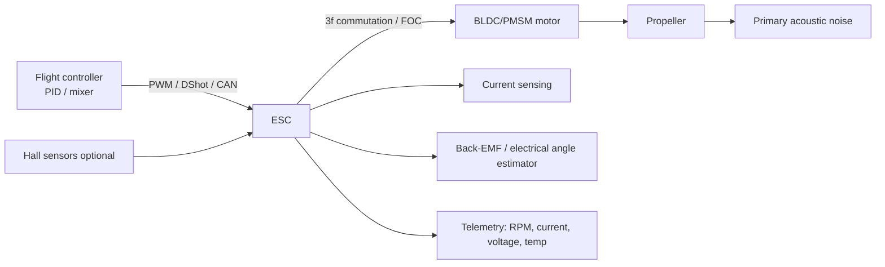
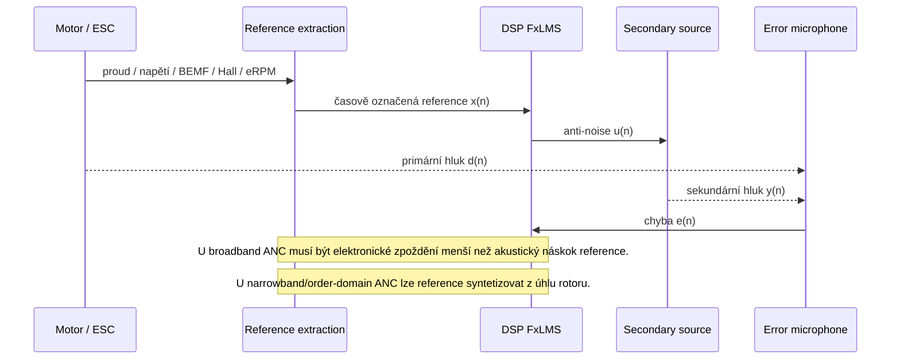

# Hloubková analýza motorů dnešních dronů, jejich řízení a použitelnosti fxLMS s referencí přímo z motoru

## Výkonné shrnutí

Současné létající drony používají pro hlavní pohon téměř výhradně třífázové bezkomutátorové motory typu BLDC/PMSM. U multirotorů dominují přímopohonové **outrunnery** s vysokým momentem při nižších otáčkách, zatímco **inrunnery** se objevují hlavně u vysokootáčkových aplikací, zejména u **EDF** a části rychlých fixed-wing platforem. **Kartáčové coreless** motory dnes přežívají hlavně v nejmenších mikroplatformách; **krokové** a **hub/rim/annular** pohony jsou pro hlavní letecký pohon spíše okrajové nebo experimentální. Konstrukční praxe výrobců UAV motorů i jejich katalogy to ukazují velmi jednoznačně. citeturn9search11turn25search1turn27search0turn27search3turn38search2

Řízení motorů se dělí na dvě vrstvy: **letový řadič → ESC** a **ESC → motor**. Na první vrstvě se dnes v multirotorové praxi prosadil **DShot**, protože je digitální, checksumem chráněný a umožňuje telemetrii; starší PWM/OneShot/MultiShot protokoly zůstávají kompatibilní, ale mají vyšší citlivost na jitter a vyžadují kalibraci. Na druhé vrstvě ESC typicky realizuje šestikrokovou komutaci nebo FOC, měří proud, odhaduje polohu rotoru ze **zpětného elektromotorického napětí** back-EMF, případně používá **Hallovy senzory**. Typické smyčky v dnešních flight controllerech běží v řádu **2–8 kHz**, zatímco interní spínací PWM ESC běží typicky kolem **24–96 kHz**; u AM32 je doložen i širší konfigurovatelný rozsah. citeturn10view0turn10view2turn10view3turn11search1turn11search12turn12search12turn35view0turn35view2turn36search0turn36search12turn36search19

Akusticky je hluk dronu směsí **tonálních** a **širokopásmových** složek. Dominují zejména **blade-passing frequency** a její harmonické, ale významné mohou být i samotné motorové tóny a elektromagneticky vybuzené složky. NASA ukázala, že po nasazení vrtule se objeví shaft-order/BPF tóny a vyšší harmonické viditelné přibližně do 4 kHz, propeler zvýší broadband přes celé spektrum a silné motorové tóny mohou být zatížením vrtulí zesíleny o **5–15 dB**. Z hlediska zdrojů tedy nestačí uvažovat jen „vrtuli“; do akustického podpisu vstupují mechanické, aerodynamické i elektromagnetické mechanismy. citeturn15view0turn15view2turn16search5turn13search2

Pro **fxLMS** je klíčové, aby referenční signál byl s rušením **silně korelovaný** a současně dostupný **dříve**, než se rušení dostane do bodu chyby; u broadband ANC jde o klasický problém **kauzality** a **koherence**. U úzce pásmového periodického hluku lze místo upstream mikrofonu použít i **neakustický synchronizační signál**, například tachometr, Hallův senzor, akcelerometr nebo jiný signál svázaný s periodou rotace; tím se zlepší robustnost vůči akustické zpětné vazbě a uvolní se kauzalitní omezení. To je velmi důležité právě pro drony, jejichž dominantní hluk je z velké části řádový a rotačně svázaný. citeturn18view1turn18view0turn19view1turn19view3turn20search1turn20search19

**Použít signál přímo z motoru jako referenci pro fxLMS je technicky možné, ale ne pro všechny akustické složky stejně dobře.** Největší smysl to má pro **řádové/tonální** složky svázané s otáčkami a elektrickým úhlem motoru: Hallovy senzory, odhad úhlu z back-EMF, elektrické RPM, proudové harmonické nebo surové fázové signály mohou být velmi dobrým zdrojem reference. Naopak **ESC telemetry** ve formě pomalého RPM/voltage/current streamu je obvykle vhodná spíše pro **order tracking**, notching a syntézu narrowband reference, ale sama o sobě nebývá dost rychlá ani dost „syrová“ pro plně broadband fxLMS. Nejlepší realistická architektura pro UAV proto není „mikrofon versus motorový signál“, ale spíše **hybrid**: motorový elektrický/úhlový signál pro úzkopásmovou řádovou část a blízké referenční mikrofony pro zbytek spektra. citeturn10view3turn35view0turn37view0turn9search12turn13search7turn21view0

Jako nejpraktičtější cesta k ověření vychází **stolní a tethered experiment** v několika krocích: nejprve jednotlivý motor bez vrtule, poté motor s vrtulí na thrust standu, následně více rotorů a teprve potom celý quadrotor. Pro audio část dává smysl **48 kHz** jako minimum a **96 kHz** jako pohodlná rezerva; pro elektrické měření proudu/napětí určené k demodulaci a časovému zarovnání je vhodné jít do **100–400 kS/s** podle zvoleného typu reference a podle interní PWM frekvence ESC. Pro prototypování jsou rozumné platformy **STM32H743**, **TI TMS320F28379D**, **dsPIC33CK** nebo audio DSP typu **ADAU1467**; z mikrofonů se pro blízké pole dobře hodí **vysoko-AOP MEMS** a pro pole/array buď TDM/PDM MEMS, nebo vícevstupový audio kodek. citeturn21view0turn29search2turn29search3turn29search6turn29search7turn30search0turn30search1turn31search1turn32search0turn32search4turn32search11turn33search0turn33search1turn39view2

## Typy motorů používaných v dnešních dronech

V dnešních UAV se termín „motor dronu“ prakticky vždy vztahuje k některé variantě **permanent-magnet brushless** motoru, řízeného ESC. To odpovídá jak dokumentaci výrobců ESC pro drony, tak katalogům výrobců UAV pohonů, které třídí produkty na multirotor, fixed-wing a VTOL brushless systémy. citeturn9search11turn25search1

Pokud je v zadání výraz **„kroužkové“ motory** myšlen jako **annular/rim-driven/hollow-shaft** konstrukce, jde v dnešní letecké UAV praxi spíše o okrajovou kategorii: buď experimentální pohon, nebo pomocné/gimbal aplikace. Pokud by tím byly míněny **coreless** mikro-motory, pak patří do kartáčové mikro-kategorie probírané níže. Tento bod je v zadání **nezadaný předpoklad** a v dalším textu vykládám „kroužkové“ jako annular/rim/hollow-shaft varianty. citeturn5search9turn7search6turn25search1

### Srovnání hlavních tříd motorů

| Typ motoru                      | Typická konstrukce a parametry                                                                                                                                                                                                                | Typické aplikace                                                                                        | Výhody                                                                               | Nevýhody                                                                                            | Reprezentativní evidence                                                                                                                                                                                                 |
| ------------------------------- | --------------------------------------------------------------------------------------------------------------------------------------------------------------------------------------------------------------------------------------------- | ------------------------------------------------------------------------------------------------------- | ------------------------------------------------------------------------------------ | --------------------------------------------------------------------------------------------------- | ------------------------------------------------------------------------------------------------------------------------------------------------------------------------------------------------------------------------ |
| **BLDC/PMSM outrunner**         | Vnější rotor, vysoký moment při nižších otáčkách, široké rozmezí KV; typické UAV datasheety uvádějí KV, hmotnost, rozměr, konfiguraci statoru/pólů, vnitřní odpor, idle current, max. proud/příkon, doporučenou vrtuli a někdy i typ ložisek. | Multirotory, VTOL lift, část propeller fixed-wing.                                                      | Vysoký moment bez převodu, jednoduchý direct drive, dobrá účinnost pro velké vrtule. | Větší rotační hmota, více vyzařuje mechanické a motorové tóny do okolí, horší pro velmi vysoké RPM. | T-Motor U8 Lite uvádí max. tah 9,1 kg, účinnost až 11,5 g/W při 3 kg tahu a životnost 1000 h; T-Motor MN3110 uvádí max. tah 1,2 kg a ložiska EZO s MTBF ~1000 h. citeturn25search0turn38search9                      |
| **BLDC/PMSM inrunner**          | Vnitřní rotor, vyšší RPM, nižší moment bez převodu, lepší odvod tepla; vhodný pro vysokootáčkové aplikace.                                                                                                                                    | EDF, rychlé fixed-wing, speciální high-speed pohony.                                                    | Vysoké otáčky, vysoká výkonová hustota, vhodné pro dmychadla a malé vrtule.          | Pro multirotor direct drive typicky nevhodný bez převodu nebo duct/fan architektury.                | EDF dokumentace uvádí běžně inrunner; Freewing 70mm EDF používá 2957-2210KV inrunner. LIGPOWER technicky popisuje EDF jako obvykle inrunner-based vysokootáčkový pohon. citeturn27search0turn27search6turn27search3 |
| **Kartáčový coreless**          | Velmi lehký mikro-motor, nízká cena, jednoduchý pohon bez třífázového ESC.                                                                                                                                                                    | Ultra-light a toy-class mikro drony.                                                                    | Nízká cena, nízká hmotnost, minimální elektronika.                                   | Nízká životnost, nižší účinnost, komutátor, horší škálování výkonu.                                 | V dnešní profesionální UAV nabídce téměř vymizel; přetrvává hlavně mimo hlavní brushless katalogy UAV výrobců. citeturn25search1turn25search11                                                                       |
| **Gimbal/hollow-shaft BLDC**    | Nízké KV, hladký chod, nízký cogging/torque ripple, často dutá hřídel; typicky optimalizované na přesné řízení a nízkou akustickou stopu.                                                                                                     | Gimbaly, směrování senzorů, pomocné osy.                                                                | Vysoká jemnost řízení, nízký momentový ripple, vhodné pro polohu.                    | Není určeno pro hlavní tah vrtule.                                                                  | T-Motor GB2208 má KV33, hmotnost 68 g a holding torque 0,07 N·m; LIGPOWER explicitně doporučuje nízké KV pro plynulé gimbal řízení. citeturn5search9turn6search3                                                     |
| **Krokový motor**               | Vysoký holding torque a přesné polohování po krocích; typicky nižší výkonová hustota a horší chování ve vysokých otáčkách.                                                                                                                    | Spíše pomocné osy, mechanismy, laboratorní a pozemní aplikace; pro hlavní letecký pohon dnes výjimečně. | Přesná poloha bez složitého snímače, vysoký statický moment.                         | Nízká hustota výkonu pro tahový pohon, horší účinnost a vysokootáčkové chování.                     | Závěr o okrajovosti pro UAV plyne z kombinace stepper charakteristik a absence v hlavních UAV propulsion katalozích. citeturn6search0turn25search1                                                                   |
| **Hub/rim/annular/hollow-ring** | Integrální nebo okružní konstrukce; v letectví spíše výzkumná či velmi speciální.                                                                                                                                                             | Experimentální pohon, integrální ventilátor, případně nepropulzní duté osy.                             | Integrace do ductu/struktury, potenciál pro kompaktní architekturu.                  | Složitost, chlazení, hmotnost, malá komerční rozšířenost v UAV mainstreamu.                         | Rim-driven/annular koncepty jsou přítomné v literatuře, ale v katalogové praxi současných UAV pohonů jsou okrajové. citeturn7search6turn25search1turn5search9                                                       |

### Co z parametrů je pro UAV nejdůležitější

V datasheetech dnešních UAV motorů se opakují zejména tyto parametry: **KV**, hmotnost, rozměr motoru/statoru, konfigurace zubů a pólů, vnitřní odpor, idle current, max. proud, max. příkon, doporučená vrtule a doporučené napětí článků. To je dobře vidět jak u velkých průmyslových, tak u menších fixed-wing motorů. Například fixed-wing T-Motor AT2820 je doložen ve variantách KV880/KV1050/KV1250 s hmotností 139–141 g, napájením 3–4S, max. výkonem 700–1000 W a konfigurací 12N14P; větší multirotor/fixed-wing motory navíc často uvádějí i bench data tahu, točivého momentu a účinnosti podle konkrétní vrtule. citeturn39view0turn26search7turn26search9

Vyšší **KV** prakticky znamená preferenci vyšších otáček, nižší **KV** naopak obvykle lepší spolupráci s větší vrtulí a vyšším momentem na ampér. To dobře odpovídá rozdílu mezi gimbal/precision a propulsion použitím i rozdílu mezi EDF a multirotor architekturou. V multirotoru je téměř vždy výhodnější nižší KV s větší vrtulí a direct drive; u EDF je smysluplný vysokootáčkový inrunner. citeturn6search3turn27search0turn27search3

Pro multirotory je prakticky rozhodující **poměr tahu k hmotnosti systému**, momentová dostupnost při rychlých změnách throttle a tepelná robustnost. Pro fixed-wing je důležitější **ustálená účinnost v cruise**, stabilita při dlouhém zatížení a vhodné sladění s vrtulí nebo EDF. Proto dnes výrobci UAV pohonů rozdělují nabídku minimálně na multirotor, fixed-wing a VTOL a často pro každou architekturu doporučují jinou geometrii motoru i vrtule. citeturn25search1turn25search3turn25search14turn25search17

## Principy řízení motorů a ESC

ESC pro dron není jen „spínač plynu“. TI jej v návrhu pro dron popisuje jako soustavu zahrnující **výkonový stupeň**, **měření proudu**, **mikrořadič pro řízení motoru** a **komunikační rozhraní** k letovému řadiči. To je důležité i pro ANC, protože právě v těchto bodech lze získat motorové signály jako potenciální reference. citeturn9search11

### Jak ESC zjišťuje polohu rotoru

U dnešních dronů je velmi rozšířené **sensorless** řízení. ST popisuje, že odhad polohy rotoru vychází z měření **back-EMF** jednotlivých fází a z detekce jeho průchodu nulou; tento přístup je přirozeně svázaný s trapezoidní/six-step komutací a je citlivější v nízkých otáčkách a při startu. Alternativou jsou **Hallovy senzory**, které dávají přímější a determinističtější informaci o poloze, ale zvyšují složitost motoru a jsou v běžných propulsion motorech dronů méně časté. Sensorless přístup je v UAV přitažlivý kvůli ceně, hmotnosti a robustnosti. citeturn9search12turn13search7turn13search11

U vyšší třídy ESC se čím dál častěji objevuje **FOC** místo klasického six-step řízení. Výrobci i polovodičové firmy jej spojují s hladším chodem, nižším torque ripple a nižší akustickou emisí. T-Motor u V-series výslovně uvádí FOC a „low-noise operation“, TI zase ukazuje, že trapezoidní řízení PMSM/BLDC vede k většímu torque ripple, zatímco sinusové/FOC schéma akustiku zlepšuje. citeturn13search20turn13search2turn13search5

### Protokoly mezi flight controllerem a ESC

| Protokol / rozhraní                  | Charakter                                | Typické časy / rychlosti                                                                                                                                      | Telemetrie                                                                                                           | Hlavní plusy                                                                                        | Hlavní mínusy                                                                                        |
| ------------------------------------ | ---------------------------------------- | ------------------------------------------------------------------------------------------------------------------------------------------------------------- | -------------------------------------------------------------------------------------------------------------------- | --------------------------------------------------------------------------------------------------- | ---------------------------------------------------------------------------------------------------- |
| **PWM**                              | Analogový pulsní protokol.               | ArduPilot uvádí normální PWM od 50 Hz výše; u RC praxe běžně stovky Hz. citeturn12search4turn11search1                                                    | Ne přímo v signálu; typicky zvláštní UART linka. citeturn10view3turn35view0                                      | Široká kompatibilita. citeturn11search1                                                          | Kalibrace ESC, citlivost na jitter/noise, nižší přesnost. citeturn11search12turn11search5        |
| **OneShot / OneShot125 / MultiShot** | Rychlejší analogové varianty.            | MultiShot má podle Betaflight API max. frame duration asi 25 µs při full throttle; DShot300 je pomalejší kvůli režii CRC. citeturn10view2                  | Telemetrie odděleně.                                                                                                 | Nízká latence.                                                                                      | Zůstává analogová citlivost na timing, menší robustnost než DShot. citeturn10view2turn11search12 |
| **DShot150/300/600/1200**            | Digitální frame.                         | DShot600: 600 kbit/s, bit 1,67 µs, 16bit frame; DShot300 a 150 jsou 2× a 4× pomalejší. citeturn10view0turn10view1                                         | Ano, jedním bitem lze požádat o telemetrii; BiDir DShot přidává ERPМ/RPM. citeturn10view0turn10view2turn10view3 | Checksum, bez kalibrace, 2000 kroků throttle, široká dnešní podpora. citeturn10view0turn10view1 | Pevná délka rámce, vyšší režie, nároky na DMA/MCU. citeturn10view0turn10view2                    |
| **Bi-directional DShot**             | DShot + návrat telemetrie po téže lince. | Betaflight uvádí přepnutí směru linky s přestávkou 30 µs; DShot300 stačí pro ~4 kHz PID loop, DShot600 pro ~8 kHz PID loop. citeturn10view2turn12search12 | Rychlé RPM/eRPM a rozšířená DShot telemetrie. citeturn10view3turn36search19                                      | Velmi užitečné pro RPM filtering a order tracking. citeturn10view3turn35view0                   | Pořád jde hlavně o odvozenou veličinu, ne o syrový proud/napětí.                                     |
| **UART ESC telemetry**               | Samostatná sériová linka z ESC do FC.    | ArduPilot default 10 Hz, lze zvýšit až na 100 Hz; Betaflight ji popisuje jako starší a pomalejší než DShot RPM telemetry. citeturn35view0turn10view3      | Napětí, proud, teplota, RPM, spotřeba – dle ESC. citeturn35view0turn37view0                                      | Jednoduché zapojení u „smart“ ESC.                                                                  | Příliš pomalé jako jediná broadband reference pro fxLMS.                                             |
| **DroneCAN**                         | CAN-based inteligentní ESC síť.          | Uživatelsky konfigurovatelná telemetrická frekvence; obousměrná komunikace po sběrnici. citeturn35view1turn37view0                                        | Error count, voltage, current, temperature, RPM, power atd. citeturn35view1                                       | Robustnost, diagnostika, průmyslové UAV. citeturn35view1turn11search7                           | Sdílená sběrnice, vyšší integrační režie; sama o sobě nepředstavuje „syrovou“ audio-rate referenci.  |

V dnešní multirotorové praxi se jako rozumná kombinace loopů a protokolů často uvádí **2K/dshot150**, **4K/dshot300** a **8K/dshot600**. Betaflight současně dokumentuje, že novější desky typicky vzorkují gyro kolem **8 kHz** u MPU6000, zatímco některé jiné IMU běží pomaleji. To je podstatné: pokud má být motorový signál použit jako reference pro fxLMS v reálném čase, musí být časově zaintegrován do smyčky, která už dnes běží v řádu jednotek kHz. citeturn35view2turn12search12

### Co znamenají I2C, SPI, UART v telemetrii

V mainstreamové dokumentaci flight controllerů a ESC se pro externí FC–ESC telemetry prakticky objevují hlavně **UART**, **DShot/BiDir DShot** a **CAN/DroneCAN**. **I2C** a **SPI** jsou v UAV častější uvnitř modulů a subsystémů – například mezi MCU a periferiemi, u audio DSP, externích ADC nebo v integrovaných smart modules – než jako standardní fyzická linka mezi FC a samostatným propulsion ESC. To je zde syntéza vycházející z dokumentace ArduPilot, Betaflight, TI a Vertiq. citeturn9search11turn10view3turn35view0turn35view1turn37view0

### Signálové toky řízení motoru



## Akustika pohonu a spektrální charakteristiky

Hluk motor–vrtule v dronu je vhodné dělit na **aerodynamický**, **mechanický** a **elektromagnetický**. Tento trojčlenný rozklad je standardní i v literatuře o elektrických strojích: mechanické zdroje souvisejí s ložisky, nevyvážeností, vibracemi hřídele a konstrukce; aerodynamické s rotorem, víry a turbulencí; elektromagnetické s magnetickými silami, nesymetrií napájení, saturací a zejména s torque ripple. citeturn16search5turn16search19turn16search21

Pro drony je navíc zásadní, že **rotující lopatky** vytvářejí velmi výrazné tonální složky. Analytická práce o quadrotorové tonalitě výslovně uvádí, že rotating-blade noise zahrnuje **násobky blade-passing frequency** a současně broadband složku od turbulence; pro malé drony je tonální složka často perceptuálně dominantní a elektrické pohony do ní mohou přidávat další elektromechanické tóny. citeturn15view2

Blade-passing frequency je dána součinem **otáčkové frekvence hřídele** a **počtu listů**. Praktický důsledek je zřejmý: i když samotná shaft frequency leží relativně nízko, její harmonické a kombinace s neideálními proudy, instalací a prouděním velmi rychle zalidní celé akusticky citlivé pásmo. Roger a kol. ukazují, že loading noise je u tenkých subsonických rotorů často dominantní a že v neaxiálním nebo instalací deformovaném proudění zhusta převládne unsteady-loading noise. citeturn15view2

NASA pak empiricky doplnila důležitý motorový rozměr: při měření malých quadcopter motorů zjistila, že **tóny jsou nejdůležitější zdroj hluku**, samotný **motor-only noise** vrcholí směrem kolmým na osu rotoru, vrtule zavádí **shaft-order/BPF** a vyšší harmonické zřetelné zhruba do **4 kHz**, zvyšuje broadband přes celé spektrum a některé silné motorové tóny mohou být zatížením vrtulí zesíleny o **5 až 15 dB**. Tato zjištění jsou pro úvahu o fxLMS zásadní, protože potvrzují, že elektrická a mechanická část motoru není akusticky zanedbatelná a může být dokonce vhodným zdrojem korelované reference. citeturn15view0turn40view3

Elektromagnetický příspěvek je zvlášť důležitý u BLDC řízených šestikrokově. TI shrnuje, že PMSM/BLDC řízený trapezoidně má větší **torque ripple**, a tím i vyšší akustickou a vibrační excitaci, zatímco sinusové/FOC řízení je používáno právě ke snížení torque ripple a akustického hluku. Z akustického hlediska je tedy rozdíl mezi „motorem“ a „způsobem jeho řízení“ menší, než se někdy intuitivně předpokládá. citeturn13search2turn13search5turn13search20

V praxi se proto u spektrální analýzy motorů dronů vyplatí sledovat nejméně čtyři vrstvy spektra: základní **shaft order**, **BPF a harmonické**, **elektrické/komutační složky** a **broadband** proudění. Teprve z jejich oddělení lze odhadnout, zda má smysl stavět referenci pro ANC na elektrickém signálu, na mikrofonu, nebo hybridně. citeturn15view0turn15view2turn17search13

## FxLMS a požadavky na referenční signál

fxLMS je praktický standard pro **feedforward ANC**, protože počítá s tím, že mezi digitálním výstupem řadiče a skutečným akustickým účinkem sekundárního zdroje leží **sekundární cesta** \(reproduktor, zesilovač, mechanika, akustická propagace\), kterou je nutné modelovat, aby adaptace nekonvergovala špatně nebo nebyla nestabilní. Klasické ANC schéma používá **referenční signál x(n)**, **řídicí filtr**, **model sekundární cesty** a **chybový mikrofon e(n)**. citeturn18view1turn19view3turn18view3

V broadband feedforward ANC musí referenční signál splnit dvě podmínky současně: musí být **dost podobný** rušení v místě chyby a musí být k dispozici **s dostatečným předstihem**, aby se anti-noise stihla spočítat a vyzářit. TI to popisuje explicitně jako požadavek **causality and high coherence** a APSIPA review doplňuje, že pokud je celkové zpracovací zpoždění delší než akustický předstih mezi referenčním senzorem a sekundárním zdrojem, výkon broadband ANC se zhorší, protože požadované řešení by bylo nekauzální. citeturn18view1turn19view1turn19view3

U **úzkopásmového periodického** hluku je situace příznivější. Tam lze upstream mikrofon nahradit **neakustickým synchronizačním signálem** – typicky tachometrem. Výhody jsou známé už dlouho: odpadá akustická zpětná vazba do referenčního mikrofonu, reference není citlivá na stárnutí a prostředí, uvolní se kauzalita a jednotlivé harmonické lze řídit selektivně. To je přesně logika, na níž stojí použití signálu přímo z motoru jako reference. citeturn18view1turn18view0turn20search1turn20search19

### Praktická struktura fxLMS pro UAV

```mermaid
flowchart LR
    R[Reference x(n)<br/>mikrofon nebo motorový signál] --> SREF[Filtrace přes model Ŝ(z)]
    SREF --> ADAPT[Adaptace FxLMS]
    R --> WFIR[Řídicí FIR W(z)]
    WFIR --> AMP[Zesilovač / DAC]
    AMP --> SPK[Sekundární zdroj]
    PRI[Primární hluk motor+vrtule] --> E[Chybový mikrofon e(n)]
    SPK --> E
    E --> ADAPT
```

### Kde se obvykle bere reference

Klasická broadband architektura používá **referenční mikrofon** umístěný co nejblíže zdroji a „upstream“ vůči bodu kontroly. U dronů to však naráží na tři problémy: silný proud vzduchu a turbulence u mikrofonu, zpětná vazba od sekundárního zdroje a extrémně malý geometrický prostor pro zachování kauzality. Dronové ANC práce z posledních let proto často experimentují s polem mikrofonů v blízkém poli, virtuálními mikrofony a směrovou redukcí místo klasické lokální „quiet zone“. citeturn19view1turn18view2turn21view0

Zajímavé je, že nejnovější experimentální práce na dronech nezůstávají u čistě lokálního ANC. Směrový drone ANC s virtuálními mikrofony použil **near-drone microphone array**, referenční senzory u vrtulí a prokázal průměrnou redukci **4,78 dB** v pásmu **1500–2400 Hz** a až **10 dB** na harmonických frekvencích. To je velmi důležitý praktický benchmark: ukazuje, že ANC na dronech už není jen teorie, ale zároveň potvrzuje, že funguje hlavně tam, kde je dost vysoká korelace a zvládnutelná dynamika přenosových cest. citeturn21view0

## Možnost použít signál přímo z motoru jako referenci pro fxLMS

Hlavní otázka zní, zda je motorový signál dostatečně **korelovaný**, **časně dostupný** a **dost širokopásmový**. Odpověď je: **ano pro řádové a tonální složky, jen omezeně pro broadband aerodynamiku**. To není slabina konkrétního signálu, ale důsledek fyziky zdroje: proud, napětí, back-EMF a Hallovy signály nesou informaci o **elektrickém a mechanickém stavu rotoru**, zatímco širokopásmové aeroakustické složky vznikají i z turbulencí, interakcí s rameny, recirkulace a instalace. Řádová část akustiky proto bývá s motorovými signály silně spojena, broadband část mnohem méně. citeturn15view2turn15view0turn18view1

### Srovnání možných referenčních signálů

| Zdroj reference                      | Co obsahuje                                                                          | Latence / determinismus                                              | Potřebné předzpracování                                                                    | Vhodnost pro fxLMS                                                                                                                                   |
| ------------------------------------ | ------------------------------------------------------------------------------------ | -------------------------------------------------------------------- | ------------------------------------------------------------------------------------------ | ---------------------------------------------------------------------------------------------------------------------------------------------------- |
| **Hall sensor / encoder**            | Přímá informace o elektrickém nebo mechanickém úhlu, přesná perioda a řádové složky. | Velmi dobrá, deterministická.                                        | Převod na úhel, harmonické báze, synchronizace s audio ADC.                                | **Nejlepší motorová reference** pro narrowband/order-domain ANC, pokud je motor senzorem vybaven. citeturn13search11turn18view1                  |
| **Back-EMF / rotor-angle estimator** | Elektrický úhel, eRPM, komutační okamžiky.                                           | Dobrá při středních a vyšších otáčkách, slabší u startu/nízkých RPM. | Diferenciální měření, demodulace, odfiltrování spínacího šumu, kalibrace pole pairs.       | **Velmi dobré** pro order tracking a syntézu harmonických reference; horší v nízkých otáčkách. citeturn9search12turn13search7                    |
| **Fázový proud / DC-link current**   | Torque ripple, komutační harmoniky, změny zatížení vrtule.                           | Potenciálně nejčasnější syrová reference, ale velmi šumová.          | Izolace/shunt, anti-aliasing, notch na PWM carrier, případně obálka či synchronní detekce. | **Velmi slibné** pro tonální a elektromechanické složky; implementačně těžší než Hall/BEMF. citeturn9search11turn24view0                         |
| **Fázové napětí**                    | Komutace, PWM, back-EMF smíchané se spínáním.                                        | Časně dostupné, ale silně kontaminované spínací složkou.             | Diferenciální HV měření, galvanické oddělení, synchronní demodulace.                       | Vhodné hlavně v laboratorním ověření, ne jako první praktická volba. citeturn9search11turn9search12                                              |
| **ESC telemetry RPM/eRPM**           | Odhadnuté RPM/eRPM, případně proud, napětí, teplota, spotřeba.                       | Dostupné snadno, ale typicky už filtrováno/kvantováno a pomalejší.   | Převod eRPM→RPM podle počtu pólů, timestamping, interpolace.                               | **Dobré pro syntetickou narrowband reference**, obvykle **nedostatečné jako jediná broadband reference**. citeturn10view3turn35view0turn37view0 |
| **Near-field reference mikrofon**    | Akustický signál všech korelovaných složek v okolí motoru/vrtule.                    | Dobrá korelace, ale zranitelný flow noise a feedbackem.              | Ochrana proti proudění, mechanické odrušení, kalibrace polohy.                             | Nejlepší volba pro broadband složku, ale náročná na rozmístění. citeturn18view1turn19view1turn21view0                                           |

### Kompatibilita a očekávaný přínos jednotlivých motorových signálů

**Hallovy senzory** jsou z hlediska ANC ideální, protože poskytují čistou, kauzálně výhodnou a prakticky bezprostřední informaci o úhlu a periodě rotace. Problém je, že běžné propulsion motory dnešních dronů je často nemají. Pokud ale stavíte vlastní propulsion modul nebo používáte smart motor/ESC modul, je to nejčistší cesta k **order-domain reference**. citeturn13search11turn37view0

**Back-EMF** je v sensorless drone ESC naprosto realistický zdroj reference, protože už v ESC fyzicky existuje. Pro fxLMS je však třeba rozlišit dvě situace: buď použijete přímo interní rotor-angle/eRPM estimator z ESC, nebo budete back-EMF měřit externě. První varianta má menší měřicí šum, ale může přinášet neznámou interní filtraci a zpoždění. Druhá varianta dá syrovější signál, ale za cenu složitějšího analogového front-endu a synchronizace. V obou případech je to výborný kandidát pro **syntézu harmonických referencí** typu sin\(kθ\), cos\(kθ\). citeturn9search12turn13search7turn18view1

**Proudové signály** jsou možná nejzajímavější z hlediska fyzikální úplnosti: nesou informaci o momentu, ripple i okamžitém zatížení vrtule, takže mohou být korelovanější s reálnou akustikou než samotné RPM. Současně jsou ale silně znehodnoceny spínací PWM, dead-time efekty a layoutovým EMI. V laboratorním setupu mají velký smysl, zejména pro porovnání s audio spektrem a výpočet koherence; pro přímo nasazený referenční signál ve flight-ready systému bývají náročnější na kvalitní analogové zpracování než Hall/BEMF reference. citeturn9search11turn24view0turn13search2

**ESC telemetry** je z hlediska integrace nejsnazší: není třeba sahat do výkonové části. Jenže typický telemetry stream je už značně zjednodušený. ArduPilot uvádí pro sériovou ESC telemetry default **10 Hz**, s možností zvýšení na **100 Hz**; Betaflight výslovně konstatuje, že DShot RPM telemetry je výrazně rychlejší než starší serial telemetry. Takový tok je skvělý pro dynamické notch filtry, order tracking nebo volbu předpočítaného ANC filtru podle RPM, ale jako **jediný vstup pro plně adaptivní broadband fxLMS** obvykle nestačí. citeturn10view3turn35view0

### Fázové zpoždění a časová synchronizace

U jakékoli reference z motoru je potřeba rozpadnout celkové zpoždění na několik částí: **měření signálu**, **interní filtraci/estimaci v ESC**, **přenos do DSP**, **výpočet fxLMS**, **DAC/zesilovač**, **sekundární zdroj** a nakonec **akustickou propagaci** k error mikrofonu. U broadband ANC platí, že součet elektronických zpoždění nesmí „sežrat“ akustický náskok reference; u narrowband ANC lze použít synchronizovaný řádový model a být podstatně tolerantnější. citeturn18view1turn19view3turn18view0

DShot a BiDir DShot jsou pro časování výhodné tím, že mají deterministickou strukturu rámce. Betaflight dokumentuje 16bit frame, u DShot600 bit time 1,67 µs a u BiDir DShot navíc fixní 30µs přepnutí linky. To je dobrá zpráva pro timestamping a následnou interpolaci reference do audio-rate domény. Naopak běžná UART telemetrie a některé CAN implementace z principu přinášejí větší a proměnlivější latenci. citeturn10view0turn10view2turn35view1

### Jaké předzpracování je nezbytné

Pro motorově odvozenou referenci je téměř vždy nutné:

1. **časově zarovnat** motorový a audio signál na společnou časovou základnu, ideálně společným hardware clockem nebo přesným timestampingem na vstupu,
2. **kalibrovat počet pólů** a převody mezi eRPM a shaft RPM,
3. **odfiltrovat PWM carrier a komutační spurie**, pokud pracujete s proudem nebo napětím,
4. **převést signál do úhlové domény** \(θ, dθ/dt\) nebo do harmonické báze,
5. **identifikovat sekundární cestu** pro daný provozní režim a sledovat, kdy model přestává platit. citeturn37view0turn18view1turn9search12turn36search12

Prakticky se velmi osvědčuje nevést do FxLMS přímo „syrový proud“, ale vytvořit z motorového signálu **syntetickou narrowband referenci**: například několik harmonických sin/cos složek řízených odhadem elektrického úhlu. Tím se z motorového signálu stane přesně to, co bude ANC nejlépe zvládat – **řádově strukturovaný prediktor tonálních složek**. To odpovídá tradiční logice tachometrového narrowband ANC. citeturn18view1turn18view0turn23search23

### Jaká účinnost potlačení je realistická

Nejrealističtější očekávání je následující: se samotnou motorovou referencí lze docela dobře cílit na **dominantní tonální harmonické**; u nich je lokální nebo směrová redukce v řádu **několika dB** až kolem **10 dB** technicky uvěřitelná, pokud je k dispozici vhodný sekundární zdroj a kvalitní model přenosových cest. Současná experimentální práce na dronech ukazuje průměr **4,78 dB** v konkrétním sub-pásmu a až **10 dB** na harmonických frekvencích. Pro plně broadband aeroakustiku je ale bez mikrofonní reference nebo bez složitější MIMO/virtual microphone architektury očekávaný přínos nižší. citeturn21view0

### Hlavní rizika a omezení

Největší technická rizika jsou čtyři. Prvním je **nečasovost a nelinearita** akustických cest při změně throttle, polohy dronu a zatížení vrtule. Druhým je **MIMO problém** více rotorů: u quadu není jeden motor jedna akustická cesta, ale čtyři vzájemně se ovlivňující zdroje. Třetím je **flow noise a strukturální vibrace** v blízkosti mikrofonů a sekundárních zdrojů. Čtvrtým je skutečnost, že propeller loading může některé motorové tóny zesílit o 5–15 dB, takže korelace mezi elektrickým a akustickým světem se sice může zlepšit, ale zároveň se zhorší lineární modelování. citeturn15view0turn18view2turn21view0

### Diagram časových zpoždění



## Experimentální ověření a návrh hardwaru

### Nezadané předpoklady

Zadání neurčuje, zda má být ANC **lokální v blízkosti stroje**, **on-board pro směrovou redukci do vybrané oblasti**, nebo **stolní laboratorní demonstrátor**. Pro smysluplné a opakovatelné ověření proto předpokládám následující postup: nejprve **bench test** v kontrolovaném prostředí, potom **tethered hover**, a teprve nakonec případné on-board směrové ANC. Tento předpoklad odpovídá i současné literatuře, která měří drony v semi-anechoických komorách nebo indoor prostředí s fixovanou polohou. citeturn18view2turn21view0

### Doporučený experimentální postup

Nejvyšší informační hodnotu má postup ve čtyřech fázích. Nejprve měřit **motor bez vrtule**, aby se oddělila čistě elektromechanická akustika a zjistila koherence mezi audio a elektrickými signály. Poté přidat **jednu vrtuli na statickém standu**, kde lze sledovat BPF, harmonické a zesílení motorových tónů zatížením. Ve třetí fázi otestovat **jednotlivý rotor s řízenými sweepy RPM** a porovnat reference \(Hall/BEMF/current/telemetry\). Teprve ve čtvrté fázi má smysl skládat **vícerotorové MIMO měření** a následně celý tethered quadrotor. Tento sled minimalizuje počet neznámých a umožní kvantifikovat, kolik informace ztrácíme při přechodu od „syrových“ motorových signálů k běžné ESC telemetry. citeturn15view0turn18view2turn21view0

### Co přesně měřit

Měřené veličiny by měly pokrýt akustickou i elektrickou doménu současně: **referenční a chybové mikrofony**, případně blízké pole + far-field/virtuální pole; **fázové nebo DC-link proudy**; **fázová napětí nebo interní rotor-angle/back-EMF estimator**; **Hall/eRPM/telemetrii z ESC**; a pokud možno i **rpm, tah a proudový odběr celé soustavy**. U DroneCAN nebo smart ESC je vhodné zaznamenávat i **voltage/current/temp/RPM** z telemetrie, ale nebrat je jako jediný zdroj reference – spíše jako ground truth pro porovnání s rychlejšími signály. citeturn35view0turn35view1turn37view0

### Doporučený hardware

| Funkce                                         | Konkrétní příklady HW                                                     | Proč dává smysl                                                                                                                                                                                                                                                                                                         |
| ---------------------------------------------- | ------------------------------------------------------------------------- | ----------------------------------------------------------------------------------------------------------------------------------------------------------------------------------------------------------------------------------------------------------------------------------------------------------------------- |
| **Blízkopolní mikrofon u vrtule**              | **TDK ICS-40638** analog MEMS.                                            | Má vysoký akustický overload point až **138 dB SPL**, vysokou teplotní odolnost a je určen do hlučných prostředí; to je blízko rotorové roviny důležité. citeturn30search0turn30search1                                                                                                                             |
| **Mikrofonní pole / více kanálů**              | **TDK ICS-52000** TDM MEMS nebo **Knowles SPH0645LM4H-B** I2S MEMS.       | ICS-52000 je oficiálně veden i pro **drone** aplikace a dává digitální TDM výstup; SPH0645 dává 24bit I2S a je snadný na MCU integraci. citeturn31search1turn31search6turn28search5                                                                                                                                |
| **Vícekanálový audio ADC/kodek**               | **TI PCM3168A**.                                                          | 6× ADC + 8× DAC, 24 bit, 96/192 kHz; vhodné pro multikanálový ANC prototyp s oddělenými error/reference mikrofony a více sekundárními zdroji. citeturn32search11turn32search5                                                                                                                                       |
| **Synchronní elektrické měření více kanálů**   | **TI ADS131M08**.                                                         | 8kanálový simultánní 24bit ADC, až 32 kS/s; ideální na současný záznam více proudových/low-rate senzorových kanálů bez fázového rozhozu. citeturn32search0turn39view1                                                                                                                                               |
| **Rychlé zachycení proudů/napětí/PWM detailu** | **TI ADS127L11** nebo MCU ADC.                                            | ADS127L11 dává až **400 kS/s** v wideband a až **1067 kS/s** v low-latency, takže je vhodný tam, kde je třeba rozlišit spínací děje 24–96 kHz a synchronně demodulovat back-EMF/proud. citeturn32search4turn32search13                                                                                              |
| **Řídicí DSP/MCU**                             | **STM32H743**, **TI TMS320F28379D**, **dsPIC33CK256MP508**, **ADAU1467**. | STM32H743 běží až na 480 MHz; F28379D je dual-core 200 MHz s PWM/ADC periferiemi a CLA; dsPIC33CK je motor-control DSC 100 MIPS; ADAU1467 je audio DSP optimalizovaný právě pro zpracování více audio streamů. citeturn29search3turn29search7turn33search0turn33search1turn33search4turn29search2turn29search6 |

### Konkrétní parametry, které doporučuji

Pro **audio řetězec ANC** doporučuji jako výchozí nastavení **48 kHz / 24 bit**, protože to odpovídá již publikovaným experimentům s drone ANC a bezpečně pokrývá celé slyšitelné pásmo s rozumnou výpočetní zátěží. Pokud chcete současně dělat detailnější spektrální diagnostiku nebo práci s více vyššími harmonickými, je pohodlnější **96 kHz**. citeturn21view0turn32search11

Pro **elektrický referenční řetězec** doporučuji dvě úrovně. Pokud používáte jen Hall/odhadnuté RPM nebo synth reference z DroneCAN/UART/DShot telemetrie, stačí event-based timestamping a řádově kHz logika. Pokud ale chcete použít **proud nebo napětí jako skutečnou surovou referenci**, je vhodné vzorkovat minimálně **100 kS/s**, a pokud ESC běží na **48–96 kHz PWM**, pak je komfortní pracovat v pásmu **200–400 kS/s**. To dává fyzikální smysl i s ohledem na dnešní ESC firmware, které používají 24/48/96 kHz a u AM32 i širší rozsahy. citeturn36search12turn36search19turn36search0turn36search6turn32search4

U filtrů doporučuji oddělit dvě větve. **Akustická větev**: antialiasing, případně band-limit ANC na cílové pásmo podle možností sekundárního zdroje. **Elektrická větev**: notch na PWM carrier, synchronní demodulace nebo order-tracking převod na úhlovou doménu. Pro první prototyp bych nezkoušel plný broadband ANC přes celé spektrum, ale spíše **narrowband/order-domain fxLMS** pro první 3–8 harmonických dominantní BPF. To je zdaleka nejpravděpodobnější cesta k funkčnímu výsledku. citeturn18view1turn23search23turn21view0

### Metriky úspěchu

Úspěch je vhodné hodnotit současně v několika pohledech. Základ je **SPL redukce v dB** v místě chyby a v cílovém směru. Druhou metrikou je **spektrální a řádová analýza**: kolik dB klesla BPF a její harmonické, co se stalo s broadband pozadím a zda nevznikly nové artefakty. Třetí metrikou je **koherence reference–error** a případně **multiple coherence**, protože právě ta určuje teoretický strop dosažitelného ANC výkonu. Čtvrtou metrikou je **čas konvergence** a robustnost při změnách throttle. A pátou je **energetická a hmotnostní cena** celého systému. citeturn19view0turn21view0turn24view0

### Alternativní přístupy

Pokud cílem není akademické ověření fxLMS, ale prakticky tišší dron, mají často lepší poměr přínos/komplexita jiné zásahy: **větší a pomalejší vrtule**, optimalizace tvaru listu, **FOC ESC**, redukce torque ripple, lepší ložiska, izolace vibrací a u vícerotorů také **synchrophasing** nebo aktivní řízení fází vrtulí. Současná literatura i výrobci potvrzují, že pasivní a konstrukční opatření zůstávají základ; ANC má smysl hlavně tam, kde jsou cíleně ošetřovány dominantní tonální složky nebo směrový přenos do citlivé oblasti. citeturn21view0turn22search10turn13search20turn38search9

## Doporučení, praktické tipy a limity

Moje hlavní technické doporučení je **nestavět první prototyp na ESC telemetry samotné**. Pokud je cílem skutečně otestovat použitelnost „signálu přímo z motoru“ pro fxLMS, pak bych jako prioritní trojici zvolil: **Hall nebo rotor-angle estimator**, **fázový/DC-link proud** a **near-field mikrofon**. Telemetrii RPM/voltage/current bych používal jako pomocný a diagnostický kanál, nikoli jako jediný referenční vstup. citeturn35view0turn37view0turn18view1

Druhé doporučení je zvolit **hybridní architekturu**. Pro tonální složky vytvořit z motorového signálu **syntetickou harmonickou referenci** vázanou na elektrický úhel rotoru; pro zbytek spektra ponechat alespoň jeden robustně chráněný referenční mikrofon. Tím se využije největší síla obou přístupů: deterministická order-domain reference z motoru a reálná akustická korelace pro broadband reziduum. Čistě motorová reference je elegantní, ale fyzikálně nikdy neobsáhne celý aeroakustický svět vrtule a instalace. citeturn18view0turn18view1turn21view0

Třetí doporučení je mít realistická očekávání od prostoru, kde bude ANC fungovat. U menších dronů a lehkých sekundárních zdrojů je mnohem reálnější **lokální nebo směrové snížení** v konkrétním pásmu nebo směru šíření než „globální ztišení dronu“. To potvrzují i nejnovější výsledky v semi-anechoických komorách. citeturn21view0turn18view2

Čtvrté doporučení je řešit zpoždění a synchronizaci jako **první-class design constraint**, ne až jako detail implementace. U broadband ANC je celková latence klíčová; u narrowband ANC je klíčové přesné sledování řádu a frekvence. Prakticky to znamená společný clock, simultánní sampling tam, kde je potřeba, převod eRPM→RPM podle pole pairs a timestamping telemetrie v okamžiku přijetí. citeturn19view3turn37view0turn39view1

Páté doporučení je uvažovat i o tiché základně pohonu. Pokud máte možnost volby ESC, pro akusticky citlivé aplikace dává smysl **FOC ESC** nebo alespoň firmware s dobře volitelnou PWM frekvencí a stabilní telemetrií. Nižší torque ripple a hladší proud nejen zlepší akustiku samy o sobě, ale současně zjednoduší modelování pro ANC. citeturn13search20turn13search2turn36search12turn36search19

### Otevřené otázky a limity

Největší otevřená otázka je, nakolik budou výsledky přenosné z **fixovaného hover testu** do reálného letu s proměnlivým zatížením, náklonem a instalací. Současná UAV ANC literatura je stále relativně mladá a často pracuje v indoor nebo semi-anechoických podmínkách. Druhý limit je hmotnost a příkon sekundárních zdrojů na samotném dronu. Třetí limit je terminologický: bez přesnější specifikace, co přesně mají v zadání znamenat „kroužkové“ motory, je tato část nutně interpretovaná jako annular/rim/hollow-shaft kategorie. A čtvrtý limit je praktický: primární české zdroje k fxLMS a ANC v UAV jsou omezené, takže zpráva stojí hlavně na anglických datasheetech, aplikačních poznámkách a akademických článcích; české zdroje zde slouží spíše doplňkově. citeturn18view2turn21view0turn36search11turn31search12
